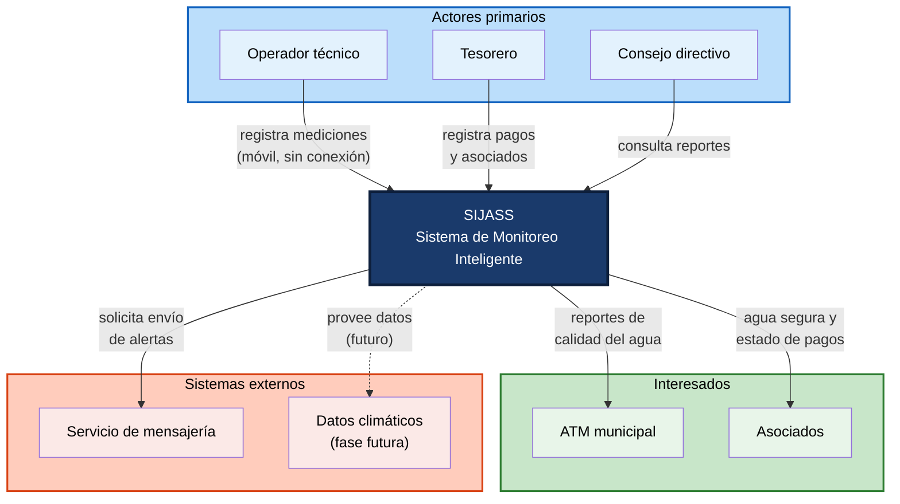

# Actores del Sistema — SIJASS

**Sistema de Monitoreo Inteligente para Juntas Administradoras de Servicios de Saneamiento (JASS) en Ayacucho**

## Objetivo
Identificar a las personas, organizaciones y sistemas externos que interactúan con SIJASS, determinando qué necesita realizar cada uno.

---

## Tabla de actores

| Actor | Rol en la JASS | ¿Qué necesita realizar? |
|---|---|---|
| **Operador técnico** | Responsable de la cloración y el mantenimiento del reservorio | Capturar la fotografía del reactivo DPD, medir el cloro residual con apoyo de IA, confirmar o corregir lecturas de baja confianza, calcular la dosis de hipoclorito y registrar operaciones sin conexión. |
| **Tesorero** | Cobra y registra las cuotas familiares | Registrar y actualizar asociados, registrar pagos de cuotas por periodo y consultar el estado de morosidad. |
| **Consejo directivo** | Presidente, secretario y vocales | Registrar la JASS, sus centros poblados y reservorios; consultar el reporte histórico de calidad del agua; gestionar usuarios y roles; recibir alertas de cloro fuera de rango. |
| **ATM municipal** | Área Técnica Municipal que fiscaliza a las JASS | Recibir reportes confiables de calidad del agua del distrito. |
| **Asociados** | Familias usuarias del servicio | Recibir agua segura y conocer su estado de pagos. |
| **Servicio de mensajería** | Sistema externo | Enviar alertas cuando el cloro esté fuera del rango objetivo. |
| **Datos climáticos** | Sistema externo (fase futura) | Proveer series históricas para analítica predictiva de demanda hídrica. |

---

## Clasificación

### Actores humanos primarios
Interactúan directamente con el sistema mediante la aplicación web progresiva (PWA).

- **Operador técnico** — usuario principal en campo, con conectividad intermitente
- **Tesorero** — gestión administrativa de asociados y cuotas
- **Consejo directivo** — supervisión, reportes y administración de usuarios

### Actores humanos secundarios (interesados)
No operan el sistema, pero se benefician de él o lo fiscalizan.

- **ATM municipal** — recibe reportes de calidad del agua
- **Asociados** — beneficiarios finales del servicio

### Sistemas externos
- **Servicio de mensajería** — envío de alertas (RF12)
- **Datos climáticos** — analítica predictiva (fuera del alcance del MVP)

---

## Diagrama de contexto

---

## Observaciones

1. El **operador técnico** es el actor crítico del sistema: trabaja en el reservorio, normalmente sin señal, por lo que toda su interacción debe funcionar sin conexión (RNF01).
2. El **ATM municipal** es un actor *externo* — recibe información pero no opera el sistema en el MVP; un panel consolidado para varias JASS del distrito queda como trabajo futuro.
3. Los **datos climáticos** aparecen con borde discontinuo por corresponder a una fase futura (analítica predictiva de demanda hídrica y stock de cloro).

---

## Próximos pasos

Los actores identificados servirán como base para redactar las **historias de usuario** (Ejercicio 04), que expresan las necesidades de cada actor desde su propia perspectiva.
