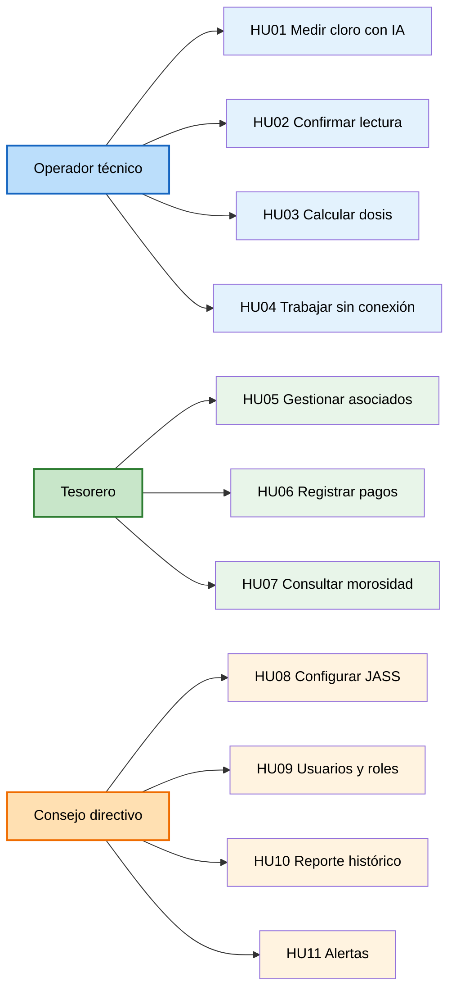

# Historias de Usuario — SIJASS

## Objetivo
Describir las principales necesidades de los usuarios desde su perspectiva, utilizando el formato:

> **Como [actor], quiero [acción], para [beneficio].**

---

## Tabla de historias de usuario

| ID | Historia de usuario | Actor | Prioridad |
|---|---|---|---|
| **HU01** | Como operador técnico, quiero capturar la fotografía del reactivo DPD y obtener una estimación automática del cloro residual, para medir sin depender de mi apreciación visual. | Operador | Must |
| **HU02** | Como operador técnico, quiero confirmar o corregir manualmente una lectura de baja confianza, para asegurar que el dato registrado sea correcto. | Operador | Must |
| **HU03** | Como operador técnico, quiero calcular la dosis de hipoclorito según el volumen y el caudal del reservorio, para clorar con la cantidad adecuada. | Operador | Must |
| **HU04** | Como operador técnico, quiero registrar mediciones y operaciones sin conexión y sincronizarlas después, para trabajar en reservorios sin señal. | Operador | Must |
| **HU05** | Como tesorero, quiero registrar y actualizar a los asociados de la JASS, para mantener el padrón al día. | Tesorero | Must |
| **HU06** | Como tesorero, quiero registrar los pagos de cuotas por periodo, para llevar el control económico sin cuadernos físicos. | Tesorero | Must |
| **HU07** | Como tesorero, quiero consultar el estado de morosidad por asociado, para saber quién debe y hacer seguimiento. | Tesorero | Must |
| **HU08** | Como consejo directivo, quiero registrar la JASS, sus centros poblados y reservorios, para tener configurado el ámbito de operación. | Consejo | Must |
| **HU09** | Como consejo directivo, quiero gestionar usuarios y roles del sistema, para controlar quién accede a cada función. | Consejo | Must |
| **HU10** | Como consejo directivo, quiero consultar el reporte histórico de calidad del agua, para supervisar el servicio y sustentarlo ante la ATM municipal. | Consejo | Should |
| **HU11** | Como consejo directivo, quiero recibir alertas cuando el cloro esté fuera de rango, para reaccionar a tiempo ante un riesgo sanitario. | Consejo | Could |

---

## Detalle de las historias

### HU01 — Medir el cloro con visión artificial
- **Actor:** Operador técnico
- **Acción:** Capturar la fotografía del reactivo DPD y obtener una estimación automática del cloro residual
- **Beneficio:** Medir sin depender de la apreciación visual del color
- **Contexto:** Hoy el operador compara el color de la pastilla DPD contra una escala impresa, bajo luz de campo variable y sin capacitación sostenida.

### HU02 — Confirmar lecturas de baja confianza
- **Actor:** Operador técnico
- **Acción:** Confirmar o corregir manualmente una lectura cuando la confianza del modelo es baja
- **Beneficio:** Asegurar que el dato registrado sea correcto
- **Nota:** La confirmación se convierte en un dato etiquetado que retroalimenta el reentrenamiento del modelo (*humano en el ciclo*).

### HU03 — Calcular la dosis de hipoclorito
- **Actor:** Operador técnico
- **Acción:** Calcular la dosis según el volumen del reservorio y el caudal
- **Beneficio:** Clorar con la cantidad adecuada, evitando sub- y sobrecloración
- **Nota:** Puede usarse de forma independiente del registro de una medición.

### HU04 — Trabajar sin conexión
- **Actor:** Operador técnico
- **Acción:** Registrar operaciones sin conexión y sincronizarlas cuando haya señal
- **Beneficio:** Poder trabajar en reservorios altoandinos sin cobertura
- **Nota:** Es la historia que más condiciona la arquitectura del sistema.

### HU05 — Gestionar asociados
- **Actor:** Tesorero
- **Acción:** Registrar y actualizar asociados
- **Beneficio:** Mantener el padrón de familias usuarias al día

### HU06 — Registrar pagos de cuotas
- **Actor:** Tesorero
- **Acción:** Registrar pagos por periodo
- **Beneficio:** Reemplazar el cuaderno físico y tener respaldo de los pagos

### HU07 — Consultar morosidad
- **Actor:** Tesorero (también consejo directivo)
- **Acción:** Consultar el estado de morosidad por asociado
- **Beneficio:** Detectar deudas y sostener económicamente a la junta

### HU08 — Configurar la JASS
- **Actor:** Consejo directivo
- **Acción:** Registrar la JASS, sus centros poblados y reservorios
- **Beneficio:** Definir el ámbito de operación del sistema

### HU09 — Gestionar usuarios y roles
- **Actor:** Consejo directivo
- **Acción:** Crear usuarios y asignarles rol
- **Beneficio:** Controlar el acceso por rol (operador, tesorero, directivo)

### HU10 — Reporte histórico de calidad
- **Actor:** Consejo directivo
- **Acción:** Consultar el histórico de mediciones de cloro
- **Beneficio:** Supervisar el servicio y sustentarlo ante la ATM municipal

### HU11 — Alertas de cloro fuera de rango
- **Actor:** Consejo directivo
- **Acción:** Recibir una alerta automática cuando una medición salga del rango objetivo
- **Beneficio:** Reaccionar a tiempo ante un riesgo sanitario

---

## Diagrama de actores y sus historias

---

## Priorización MoSCoW

| Prioridad | Historias | Cantidad |
|---|---|---|
| **Must** (indispensable para el MVP) | HU01, HU02, HU03, HU04, HU05, HU06, HU07, HU08, HU09 | 9 |
| **Should** (deseable) | HU10 | 1 |
| **Could** (opcional) | HU11 | 1 |

---

## Próximos pasos

Estas historias servirán como base para identificar los **requisitos funcionales** (Ejercicio 05). Cada historia se descompondrá en una o más funcionalidades específicas que el sistema debe implementar.
