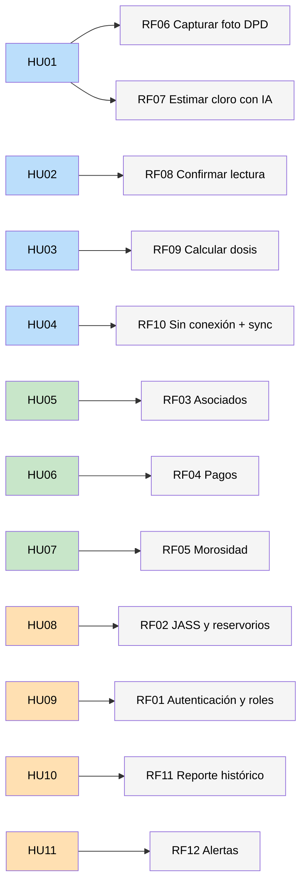

# Requisitos Funcionales — SIJASS

## Objetivo
Identificar y documentar las funcionalidades que el sistema debe proporcionar, derivadas de las historias de usuario.

---

## Diferencia importante

| Concepto | Definición |
|---|---|
| **Historia de usuario** | Expresa la necesidad desde el punto de vista del usuario. |
| **Requisito funcional** | Expresa lo que el sistema debe hacer para satisfacer esa necesidad. |

---

## Requisitos Funcionales priorizados (MoSCoW)

| ID | Requisito funcional | Actor | Prioridad |
|---|---|---|---|
| **RF01** | Autenticar usuarios y controlar el acceso por rol. | Todos | Must |
| **RF02** | Registrar la JASS, sus centros poblados y reservorios. | Consejo | Must |
| **RF03** | Registrar y actualizar asociados. | Tesorero | Must |
| **RF04** | Registrar pagos de cuotas por periodo. | Tesorero | Must |
| **RF05** | Consultar el estado de morosidad por asociado. | Tesorero, consejo | Must |
| **RF06** | Capturar la fotografía del reactivo DPD. | Operador | Must |
| **RF07** | Estimar el cloro residual con IA e indicar el nivel de confianza. | Operador | Must |
| **RF08** | Confirmar o corregir manualmente una lectura de baja confianza. | Operador | Must |
| **RF09** | Calcular la dosis de hipoclorito según volumen y caudal. | Operador | Must |
| **RF10** | Registrar operaciones sin conexión y sincronizarlas después. | Operador, tesorero | Must |
| **RF11** | Generar el reporte histórico de calidad del agua. | Consejo | Should |
| **RF12** | Enviar alertas cuando el cloro esté fuera de rango. | Consejo | Could |

---

## Relación entre Historias de Usuario y Requisitos Funcionales

| Historia de usuario | Requisitos funcionales relacionados |
|---|---|
| **HU01** Medir cloro con visión artificial | RF06, RF07 |
| **HU02** Confirmar lecturas de baja confianza | RF08 |
| **HU03** Calcular dosis de hipoclorito | RF09 |
| **HU04** Trabajar sin conexión | RF10 |
| **HU05** Gestionar asociados | RF03 |
| **HU06** Registrar pagos de cuotas | RF04 |
| **HU07** Consultar morosidad | RF05 |
| **HU08** Configurar la JASS | RF02 |
| **HU09** Gestionar usuarios y roles | RF01 |
| **HU10** Reporte histórico de calidad | RF11 |
| **HU11** Alertas de cloro fuera de rango | RF12 |

---

## Detalles de los Requisitos Funcionales

### RF01 — Autenticación y control de acceso por rol
- **Descripción:** El sistema debe autenticar usuarios y controlar el acceso según su rol (operador, tesorero, consejo directivo).
- **Historia relacionada:** HU09
- **Criterios de aceptación:**
  - El usuario inicia sesión con credenciales propias
  - Las contraseñas se almacenan cifradas con bcrypt
  - La sesión usa tokens JWT con expiración
  - Cada rol solo accede a las funciones que le corresponden

### RF02 — Registro de la JASS, centros poblados y reservorios
- **Descripción:** El sistema debe permitir registrar la organización, los centros poblados que administra y sus reservorios.
- **Historia relacionada:** HU08
- **Criterios de aceptación:**
  - Una JASS puede administrar varios centros poblados
  - Cada reservorio registra nombre, volumen (m³) y caudal (L/s)
  - Estos datos alimentan el cálculo de la dosis (RF09)

### RF03 — Registro y actualización de asociados
- **Descripción:** El sistema debe permitir registrar y actualizar a las familias usuarias del servicio.
- **Historia relacionada:** HU05
- **Criterios de aceptación:**
  - Se registran nombres, DNI, centro poblado y estado
  - El asociado puede darse de baja sin perder su historial de pagos

### RF04 — Registro de pagos de cuotas
- **Descripción:** El sistema debe permitir registrar los pagos de cuotas familiares por periodo.
- **Historia relacionada:** HU06
- **Criterios de aceptación:**
  - Cada pago registra asociado, periodo, monto y fecha
  - El pago puede registrarse sin conexión y sincronizarse después (RF10)

### RF05 — Consulta de morosidad
- **Descripción:** El sistema debe permitir consultar el estado de morosidad por asociado.
- **Historia relacionada:** HU07
- **Criterios de aceptación:**
  - Se lista qué asociados tienen periodos pendientes
  - Se muestra el monto adeudado acumulado

### RF06 — Captura de la fotografía del reactivo DPD
- **Descripción:** El sistema debe permitir capturar la fotografía del tubo con el reactivo DPD disuelto.
- **Historia relacionada:** HU01
- **Criterios de aceptación:**
  - La captura se realiza desde la cámara del teléfono
  - La tarjeta de calibración cromática aparece junto al tubo en la toma
  - El sistema aplica corrección de balance de blancos y recorte (ROI)

### RF07 — Estimación del cloro residual con IA
- **Descripción:** El sistema debe estimar el cloro residual a partir de la fotografía e indicar el nivel de confianza.
- **Historia relacionada:** HU01
- **Criterios de aceptación:**
  - La inferencia se ejecuta localmente en el teléfono (ONNX Runtime Web)
  - Se clasifica en seis rangos de la escala DPD: 0.0, 0.2, 0.5, 1.0, 1.5 y ≥ 2.0 mg/L
  - Se devuelve la probabilidad de la clase elegida como nivel de confianza
  - Se registra la versión del modelo que produjo la lectura

### RF08 — Confirmación manual de lecturas
- **Descripción:** El sistema debe pedir confirmación al operador cuando la confianza del modelo sea inferior al umbral.
- **Historia relacionada:** HU02
- **Criterios de aceptación:**
  - Si la confianza < umbral, el sistema solicita confirmación
  - El operador puede aceptar o corregir el valor estimado
  - La lectura confirmada se marca como muestra verificada para reentrenamiento

### RF09 — Cálculo de la dosis de hipoclorito
- **Descripción:** El sistema debe calcular la dosis de hipoclorito según el volumen del reservorio, el caudal y la concentración objetivo.
- **Historia relacionada:** HU03
- **Criterios de aceptación:**
  - Dosis por carga: `P_carga [g] = (C · V) / (p/100)`
  - Dosis diaria: `P_diaria [g/día] = (C · Q · 86.4) / (p/100)`
  - El rango objetivo (por defecto 0.5–1.0 mg/L) es configurable
  - Si la lectura queda fuera del rango, el sistema sugiere ajustar la dosis

### RF10 — Operación sin conexión y sincronización
- **Descripción:** El sistema debe registrar mediciones y pagos sin conexión y sincronizarlos cuando haya señal, sin duplicar datos.
- **Historia relacionada:** HU04
- **Criterios de aceptación:**
  - El 100 % de las operaciones se conserva localmente hasta sincronizar
  - Cada operación lleva un identificador único (UUID) generado en el teléfono
  - Reenviar un lote no genera registros duplicados (operaciones idempotentes)
  - El estado de sincronización es visible para el usuario

### RF11 — Reporte histórico de calidad del agua
- **Descripción:** El sistema debe generar un reporte del histórico de mediciones de cloro.
- **Historia relacionada:** HU10
- **Criterios de aceptación:**
  - Se filtra por reservorio y rango de fechas
  - Se muestran las mediciones con su valor, confianza y fecha
  - El reporte es exportable para presentarlo a la ATM municipal

### RF12 — Alertas de cloro fuera de rango
- **Descripción:** El sistema debe enviar alertas cuando una medición quede fuera del rango objetivo.
- **Historia relacionada:** HU11
- **Criterios de aceptación:**
  - La alerta se dispara al sincronizar una medición fuera de rango
  - El envío se delega a un servicio de mensajería externo
  - El consejo directivo recibe la notificación

---

## Diagrama de trazabilidad

---

## Casos de uso derivados

| ID | Caso de uso | Requisitos que cubre |
|---|---|---|
| **CU01** | Registrar medición de cloro | RF06, RF07 (include CU02) |
| **CU02** | Estimar cloro residual con IA | RF07, RF08 |
| **CU03** | Calcular dosis de hipoclorito | RF09 |
| **CU04** | Sincronizar datos pendientes | RF10 |
| **CU05** | Registrar asociado | RF03 |
| **CU06** | Registrar pago de cuota | RF04 |
| **CU07** | Consultar morosidad | RF05 |
| **CU08** | Consultar reporte de calidad | RF11 |
| **CU09** | Gestionar usuarios y roles | RF01, RF02 |

---

## Próximos pasos

Los requisitos funcionales servirán como base para:
1. **Ejercicio 06:** Identificar atributos de calidad
2. **Ejercicio 07:** Identificar restricciones
3. **Ejercicio 08:** Identificar drivers arquitectónicos
4. **Ejercicio 09:** Diseñar la arquitectura en capas
