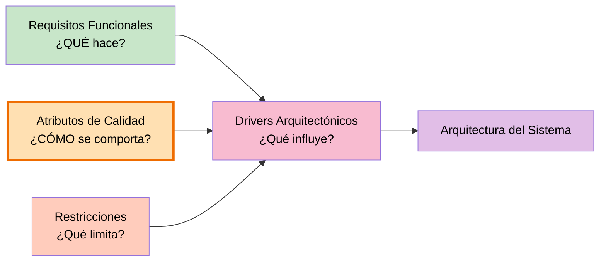

# Atributos de Calidad — SIJASS

## Objetivo
Determinar cómo debe comportarse el sistema, además de qué debe hacer. Siguiendo a Bass et al. (2021), los requisitos no funcionales se expresan como **escenarios medibles**, porque son los que más condicionan las decisiones de arquitectura.

---

## Escenario de contexto

El operador técnico de una JASS sube al reservorio, ubicado en un centro poblado altoandino **sin cobertura de red**, con un teléfono de gama media-baja. Debe medir el cloro residual, calcular la dosis y registrar la operación. Horas después, al volver al pueblo, el teléfono recupera señal. ¿Qué atributos de calidad resultan críticos?

---

## Tabla de Atributos de Calidad

| ID | Atributo | Escenario y métrica |
|---|---|---|
| **RNF01** | **Disponibilidad sin conexión** | Sin señal, el operador registra mediciones y pagos; el 100 % se conserva localmente hasta sincronizar. |
| **RNF02** | **Rendimiento** | La inferencia del modelo en un teléfono de gama media tarda como máximo 2 s. |
| **RNF03** | **Exactitud de la IA** | Exactitud ≥ 85 % por rango de cloro y error absoluto medio ≤ 0.2 mg/L. |
| **RNF04** | **Integridad de datos** | Reenviar un lote no genera registros duplicados (operaciones idempotentes). |
| **RNF05** | **Seguridad** | Comunicación HTTPS, tokens JWT con expiración y contraseñas cifradas con bcrypt. |
| **RNF06** | **Usabilidad** | Una medición completa se registra en 3 pasos o menos, con lenguaje sencillo. |
| **RNF07** | **Modificabilidad** | Un módulo nuevo (p. ej., reporte de fugas) se agrega sin modificar los existentes. |
| **RNF08** | **Portabilidad** | Funciona en Android 8 o superior con un navegador basado en Chromium. |

---

## Detalle de los Atributos de Calidad

### RNF01 — Disponibilidad sin conexión 📴

**¿Qué significa?**
Capacidad de operar plenamente sin acceso a la red, conservando todo el trabajo hasta que haya conectividad.

**Escenario de calidad:**
Sin señal, el operador registra mediciones y pagos; el 100 % de las operaciones se conserva localmente hasta sincronizar.

**Criterios de éxito:**
- Ninguna operación se pierde por falta de conexión
- La aplicación abre y funciona completa sin red (incluido el modelo de IA)
- El usuario ve claramente cuántas operaciones están pendientes de sincronizar
- La sincronización se reintenta automáticamente al recuperar señal

**Impacto en la arquitectura:**
- Aplicación web progresiva (PWA) con Service Worker (Workbox)
- Persistencia local en IndexedDB (Dexie)
- Modelo `.onnx` descargado y cacheado por el Service Worker
- Cola local de operaciones pendientes con estado de sincronización

> Este es el atributo **más determinante** de toda la arquitectura de SIJASS.

---

### RNF02 — Rendimiento ⚡

**¿Qué significa?**
Capacidad de responder dentro de un tiempo aceptable, en el hardware real del usuario.

**Escenario de calidad:**
La inferencia del modelo en un teléfono de gama media tarda como máximo 2 s.

**Criterios de éxito:**
- Inferencia local ≤ 2 s en un dispositivo de gama media
- La aplicación no se bloquea durante la inferencia
- El cálculo de la dosis es instantáneo (operación aritmética local)
- La sincronización de un lote no degrada la interfaz

**Impacto en la arquitectura:**
- Modelo ligero: MobileNetV3-Small, no una red pesada
- Cuantización INT8 para reducir tamaño y tiempo de cómputo
- Inferencia en el dispositivo, evitando la latencia de red
- Caché en Redis en el backend para consultas repetidas

---

### RNF03 — Exactitud de la IA 🎯

**¿Qué significa?**
Grado en que la estimación del modelo coincide con la concentración real de cloro.

**Escenario de calidad:**
Exactitud ≥ 85 % por rango de cloro y error absoluto medio (MAE) ≤ 0.2 mg/L.

**Criterios de éxito:**
- Exactitud ≥ 85 % evaluada por clase, no solo global
- MAE ≤ 0.2 mg/L sobre el conjunto de validación
- Matriz de confusión sin confusiones sistemáticas entre rangos adyacentes críticos
- El umbral de confianza se calibra con el conjunto de validación

**Impacto en la arquitectura:**
- Tarjeta de calibración cromática impresa junto al tubo en cada foto
- Corrección de balance de blancos y recorte (ROI) antes de inferir
- Aumento de datos: iluminación, ángulo y ruido
- *Humano en el ciclo*: confirmación manual cuando la confianza es baja
- Versionado del modelo: cada medición guarda qué versión la produjo

---

### RNF04 — Integridad de datos 🔗

**¿Qué significa?**
Garantía de que los datos sincronizados son consistentes y no se duplican.

**Escenario de calidad:**
Reenviar un lote no genera registros duplicados (operaciones idempotentes).

**Criterios de éxito:**
- Un lote reenviado por corte de red produce exactamente el mismo estado final
- Cada operación lleva un UUID generado en el cliente
- El servidor rechaza silenciosamente operaciones ya procesadas
- No hay pérdida de datos ante fallos de red parciales

**Impacto en la arquitectura:**
- UUID generado en el teléfono, no en el servidor
- Claves de idempotencia almacenadas en Redis
- Operaciones de solo inserción (las mediciones y pagos se agregan, no se editan)
- Transacciones ACID en PostgreSQL

---

### RNF05 — Seguridad 🔒

**¿Qué significa?**
Protección de la información y control de acceso a los recursos del sistema.

**Escenario de calidad:**
Comunicación HTTPS, tokens JWT con expiración y contraseñas cifradas con bcrypt.

**Criterios de éxito:**
- Todo el tráfico viaja sobre HTTPS
- Las contraseñas nunca se almacenan en texto plano (hash bcrypt)
- Los tokens JWT expiran y deben renovarse
- Cada rol accede únicamente a sus funciones (mínimo privilegio)

**Impacto en la arquitectura:**
- Módulo de identidad y acceso separado en el backend
- Middleware de validación de tokens en la capa de presentación
- Control de acceso basado en roles (RBAC)
- Seguridad aplicada desde el diseño, no añadida al final

---

### RNF06 — Usabilidad 👤

**¿Qué significa?**
Facilidad con que un directivo *ad honórem*, sin formación técnica, opera el sistema.

**Escenario de calidad:**
Una medición completa se registra en 3 pasos o menos, con lenguaje sencillo.

**Criterios de éxito:**
- Registrar una medición toma como máximo 3 pasos
- El vocabulario es el de la junta, no el de la informática
- La interfaz funciona con una sola mano en un teléfono
- Los errores se explican en términos accionables

**Impacto en la arquitectura:**
- Interfaz móvil primero (*mobile first*)
- Flujo de captura → estimación → confirmación sin pantallas intermedias
- Estado de sincronización visible pero no intrusivo

---

### RNF07 — Modificabilidad 🔧

**¿Qué significa?**
Facilidad para agregar funcionalidad nueva sin romper lo existente.

**Escenario de calidad:**
Un módulo nuevo (p. ej., reporte de fugas) se agrega sin modificar los existentes.

**Criterios de éxito:**
- Agregar un módulo no obliga a tocar los módulos ya construidos
- Las reglas de negocio no dependen de la base de datos ni del framework
- Los módulos se comunican por interfaces, no por dependencias directas
- El monolito modular puede separarse en servicios más adelante

**Impacto en la arquitectura:**
- Cuatro capas: presentación, aplicación, dominio e infraestructura
- Regla de dependencia: Presentación → Aplicación → Dominio ← Infraestructura
- Las interfaces de repositorio se definen en el dominio y la infraestructura las implementa
- Alta cohesión y bajo acoplamiento por módulo de dominio

---

### RNF08 — Portabilidad 📱

**¿Qué significa?**
Capacidad de funcionar en el hardware que las JASS realmente tienen.

**Escenario de calidad:**
Funciona en Android 8 o superior con un navegador basado en Chromium.

**Criterios de éxito:**
- No requiere instalación desde tienda de aplicaciones
- Funciona en teléfonos de gama media-baja
- Una sola base de código para todos los dispositivos
- El costo de adopción para la JASS es mínimo: basta un teléfono con navegador

**Impacto en la arquitectura:**
- PWA en lugar de aplicación nativa
- APIs web estándar (IndexedDB, Service Worker, WebAssembly)
- ONNX Runtime Web, que corre en el navegador

---

## Diferencia entre Requisito Funcional y Atributo de Calidad

| Aspecto | Requisito Funcional | Atributo de Calidad |
|---|---|---|
| **¿Qué pregunta responde?** | ¿Qué debe hacer el sistema? | ¿Cómo debe comportarse el sistema? |
| **Ejemplo en SIJASS** | RF07: estimar el cloro residual con IA. | RNF02/RNF03: la inferencia tarda ≤ 2 s y acierta ≥ 85 %. |

---

## Relación con otros elementos

---

## Resumen y priorización

| ID | Atributo | Importancia | Impacto en la arquitectura |
|---|---|---|---|
| **RNF01** | Disponibilidad sin conexión | **Crítica** | PWA, IndexedDB, Service Worker, cola local |
| **RNF03** | Exactitud de la IA | **Crítica** | Tarjeta cromática, humano en el ciclo, versionado |
| **RNF04** | Integridad de datos | **Crítica** | UUID cliente, idempotencia en Redis |
| **RNF05** | Seguridad | **Crítica** | HTTPS, JWT, bcrypt, RBAC |
| **RNF02** | Rendimiento | **Alta** | MobileNetV3-Small, cuantización INT8 |
| **RNF08** | Portabilidad | **Alta** | PWA sobre Chromium, sin app nativa |
| **RNF07** | Modificabilidad | **Alta** | Monolito modular en cuatro capas |
| **RNF06** | Usabilidad | **Media-Alta** | Flujo de 3 pasos, lenguaje de la junta |

---

## Próximos pasos

Los atributos de calidad contribuirán a definir:
1. **Ejercicio 07:** Restricciones
2. **Ejercicio 08:** Drivers arquitectónicos
3. **Ejercicio 09:** Diseño de la arquitectura en capas
