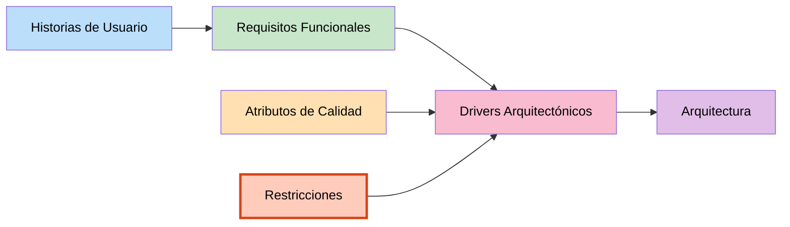

# Restricciones — SIJASS

## Objetivo
Identificar las restricciones que condicionan las decisiones de diseño y arquitectura del sistema. Pueden ser tecnológicas, organizacionales, del entorno, normativas o del proyecto.

## Definición

**Restricciones:** Son condiciones, reglas o limitaciones que deben respetarse durante el desarrollo del sistema y que influyen significativamente en cómo se diseña la arquitectura. A diferencia de los atributos de calidad, **no son negociables**.

---

## Tabla de Restricciones

| ID | Restricción | Tipo | Descripción |
|---|---|---|---|
| **RC01** | Conectividad intermitente o nula | Entorno | Los reservorios están en centros poblados altoandinos y dispersos, sin cobertura garantizada. |
| **RC02** | Hardware modesto | Entorno | Los operadores usan teléfonos de gama media-baja con Android 8 o superior. |
| **RC03** | Equipo de una sola persona | Proyecto | El desarrollo lo ejecuta un único desarrollador en ocho semanas. |
| **RC04** | Aplicación web progresiva (PWA) | Tecnológica | La solución debe entregarse como PWA, sin instalación desde tienda de aplicaciones. |
| **RC05** | Software libre | Organizacional | Se debe usar únicamente software libre o con licencias compatibles, por el costo de adopción de la JASS. |
| **RC06** | Backend en Node.js / NestJS | Tecnológica | El backend se implementa como monolito modular sobre Node.js con NestJS. |
| **RC07** | Base de datos PostgreSQL | Tecnológica | Los datos transaccionales se almacenan en PostgreSQL. |
| **RC08** | Inferencia en el dispositivo | Tecnológica | El modelo de IA debe ejecutarse localmente mediante ONNX Runtime Web. |
| **RC09** | Comunicación REST con JWT | Tecnológica | La PWA se comunica con el backend mediante API REST autenticada con tokens JWT. |
| **RC10** | Servicio de mensajería externo | Tecnológica | El envío de alertas se delega a un servicio de mensajería externo. |
| **RC11** | Normativa de calidad del agua | Normativa | El agua distribuida debe mantener un cloro residual libre de al menos 0.5 mg/L (D.S. N.° 031-2010-SA). |
| **RC12** | Control de versiones con Git | Organizacional | El código fuente se gestiona con Git en un repositorio compartido. |

---

## Detalle de las Restricciones

### RC01 — Conectividad intermitente o nula 📡

**Tipo:** Entorno operativo
**Descripción:** Los reservorios se ubican en centros poblados altoandinos y dispersos, donde no hay garantía de señal.

**Implicaciones:**
- El sistema no puede asumir conexión en ningún momento del flujo principal
- La inferencia de IA no puede depender de una llamada al servidor
- Los datos deben persistir localmente hasta que haya señal
- La sincronización debe tolerar cortes e interrupciones

**Impacto en la arquitectura:**
- PWA con Service Worker y persistencia en IndexedDB
- Modelo `.onnx` descargado y cacheado en el dispositivo
- Cola de operaciones pendientes con reintento automático
- Idempotencia obligatoria en el endpoint de sincronización

> Es la restricción **más influyente** del proyecto: prácticamente todas las decisiones arquitectónicas se justifican frente a ella.

---

### RC02 — Hardware modesto 📱

**Tipo:** Entorno operativo
**Descripción:** Los operadores disponen de teléfonos de gama media-baja con Android 8 o superior.

**Implicaciones:**
- Memoria y CPU limitadas para ejecutar un modelo de visión artificial
- No se puede usar una red neuronal pesada
- El tamaño de descarga del modelo debe ser reducido
- Las pruebas deben hacerse en dispositivos reales, no solo en emulador

**Impacto en la arquitectura:**
- MobileNetV3-Small en lugar de arquitecturas grandes
- Cuantización INT8 del modelo exportado
- Pruebas tempranas en dispositivos representativos
- Navegador basado en Chromium como plataforma de ejecución

---

### RC03 — Equipo de una sola persona 👤

**Tipo:** Proyecto
**Descripción:** El desarrollo lo ejecuta un único desarrollador a lo largo de ocho semanas.

**Implicaciones:**
- No es viable operar una arquitectura de microservicios
- El alcance debe cerrarse de forma estricta (MVP acotado)
- La complejidad operativa debe ser mínima
- Las actividades de mayor riesgo deben empezar temprano

**Impacto en la arquitectura:**
- **Monolito modular** en lugar de microservicios (ADR-01)
- Los módulos quedan preparados para separarse más adelante si hace falta
- Despliegue simple, con pocos componentes que operar
- La recolección del *dataset* empieza en la tercera semana, en paralelo

---

### RC04 — Aplicación web progresiva 🌐

**Tipo:** Tecnológica
**Descripción:** La solución debe entregarse como PWA, sin instalación desde tienda de aplicaciones.

**Implicaciones:**
- Una sola base de código para todos los dispositivos
- Instalación directa desde el navegador, sin intermediarios
- Actualización inmediata sin pasar por revisión de tienda
- Dependencia de las APIs web disponibles en el navegador

**Impacto en la arquitectura:**
- React + Vite + Workbox en el cliente
- Service Worker para caché de aplicación y modelo
- IndexedDB (Dexie) como almacenamiento local
- Renuncia a APIs nativas no expuestas al navegador

---

### RC05 — Software libre 💰

**Tipo:** Organizacional / económica
**Descripción:** Se debe usar únicamente software libre o con licencias compatibles.

**Implicaciones:**
- El costo de adopción para la JASS debe ser prácticamente nulo
- No se pueden usar servicios de pago obligatorios
- Todas las dependencias deben auditarse por licencia
- El proyecto debe documentar sus licencias

**Impacto en la arquitectura:**
- Selección de frameworks y librerías con licencias MIT, Apache o BSD
- PostgreSQL y Redis en lugar de bases de datos comerciales
- ONNX Runtime (MIT) para la inferencia
- Basta un teléfono con navegador para adoptar el sistema

---

### RC06 — Backend en Node.js / NestJS 🖥️

**Tipo:** Tecnológica
**Descripción:** El backend se implementa como monolito modular sobre Node.js con NestJS.

**Implicaciones:**
- Un solo lenguaje (TypeScript) en cliente y servidor
- NestJS impone una estructura modular por diseño
- Operaciones asincrónicas (async/await) en todo el backend
- Gestión de dependencias con npm

**Impacto en la arquitectura:**
- Módulos de dominio: identidad, cuotas, cloración y sincronización
- Inyección de dependencias nativa del framework
- Separación en capas dentro de cada módulo

---

### RC07 — Base de datos PostgreSQL 🗄️

**Tipo:** Tecnológica
**Descripción:** Los datos transaccionales se almacenan en PostgreSQL (ADR-04).

**Implicaciones:**
- Los datos son relacionales por naturaleza (asociados, pagos, mediciones)
- Se requiere consistencia fuerte en las operaciones de pago
- Se descarta una base NoSQL por la necesidad de integridad referencial
- Uso de transacciones ACID

**Impacto en la arquitectura:**
- Modelo conceptual normalizado (JASS, CentroPoblado, Reservorio, Asociado, Pago, Usuario, MedicionCloro, ModeloIA)
- Claves foráneas para garantizar integridad
- Repositorios definidos en el dominio e implementados en infraestructura

---

### RC08 — Inferencia en el dispositivo 🧠

**Tipo:** Tecnológica
**Descripción:** El modelo de IA debe ejecutarse localmente mediante ONNX Runtime Web (ADR-03).

**Implicaciones:**
- El modelo debe exportarse a formato `.onnx`
- El entrenamiento ocurre fuera de línea (Python, PyTorch)
- El servidor solo verifica las lecturas de forma asíncrona, después
- El ciclo de vida del modelo es independiente del ciclo de vida del backend

**Impacto en la arquitectura:**
- **Servicio de IA separado** del backend (Python, FastAPI, ONNX Runtime)
- Pipeline de entrenamiento fuera de línea que publica modelos versionados
- Almacén de objetos para fotos y modelos `.onnx`
- Descarga y caché del modelo por el Service Worker

---

### RC09 — Comunicación REST con JWT 🔌

**Tipo:** Tecnológica
**Descripción:** La PWA se comunica con el backend mediante API REST autenticada con tokens JWT.

**Implicaciones:**
- Backend sin estado (*stateless*), lo que permite escalar horizontalmente
- Endpoints REST con métodos HTTP estándar y respuestas JSON
- El token viaja en cada petición
- La sincronización se expone como un endpoint de lote (`POST /sync`)

**Impacto en la arquitectura:**
- Separación clara entre cliente y servidor
- Sesiones con JWT y caché en Redis
- Middleware de validación de tokens en la capa de presentación

---

### RC10 — Servicio de mensajería externo 📨

**Tipo:** Tecnológica
**Descripción:** El envío de alertas se delega a un servicio de mensajería externo.

**Implicaciones:**
- SIJASS no implementa el canal de envío por sí mismo
- Se depende de la disponibilidad del proveedor externo
- El envío debe ser asíncrono para no bloquear la sincronización
- Corresponde a un requisito de prioridad *Could* (RF12)

**Impacto en la arquitectura:**
- Módulo de integración aislado, invocado desde la lógica de cloración
- Fallo del servicio externo no debe afectar el registro de la medición

---

### RC11 — Normativa de calidad del agua ⚖️

**Tipo:** Normativa / legal
**Descripción:** El agua distribuida debe mantener un cloro residual libre de al menos 0.5 mg/L (D.S. N.° 031-2010-SA).

**Implicaciones:**
- El rango objetivo del sistema debe alinearse con la norma (0.5–1.0 mg/L por defecto)
- Las clases del modelo deben cubrir los rangos relevantes de la escala DPD
- Los reportes deben servir como sustento ante la ATM municipal
- El rango debe ser configurable si la norma cambia

**Impacto en la arquitectura:**
- Rango objetivo parametrizable, no fijo en el código
- Regla de dosificación como entidad del dominio (`ReglaDosificacion`)
- Trazabilidad: cada medición guarda la versión del modelo que la produjo

---

### RC12 — Control de versiones con Git 📝

**Tipo:** Organizacional
**Descripción:** El código fuente se gestiona con Git en un repositorio compartido.

**Implicaciones:**
- Todos los cambios quedan versionados
- Convenciones de mensajes de commit consistentes
- La rama principal debe mantenerse estable
- La documentación de arquitectura vive junto al código

**Impacto en la arquitectura:**
- Registros de decisiones arquitectónicas (ADR) versionados en el repositorio
- Documentación C4 como parte del proyecto
- Integración continua para pruebas automatizadas

---

## Registro de decisiones arquitectónicas (ADR) derivadas

| ADR | Decisión | Alternativa descartada | Restricción que la motiva |
|---|---|---|---|
| **01** | Monolito modular (NestJS) | Microservicios | RC03 — un solo desarrollador, ocho semanas |
| **02** | Aplicación web progresiva | App nativa Android | RC04, RC05 — una base de código, sin tienda |
| **03** | Inferencia en el dispositivo | Inferencia solo en servidor | RC01 — no hay señal en el reservorio |
| **04** | PostgreSQL | Base NoSQL | RC07 — datos relacionales que requieren consistencia |
| **05** | Cola de operaciones con UUID | Sincronización con CRDT | RC01, RC03 — la idempotencia basta y es más simple |

---

## Diferencia entre Restricción y Atributo de Calidad

| Aspecto | Restricción | Atributo de Calidad |
|---|---|---|
| **¿Qué es?** | Limitación o condición impuesta | Característica deseable, medible |
| **¿Es negociable?** | No | Sí, admite grados de cumplimiento |
| **Ejemplo en SIJASS** | RC01: no hay señal en el reservorio | RNF01: el 100 % de operaciones se conserva localmente |

---

## Matriz de Restricciones por tipo

| Tipo | Restricciones | Cantidad |
|---|---|---|
| **Entorno operativo** | RC01, RC02 | 2 |
| **Tecnológicas** | RC04, RC06, RC07, RC08, RC09, RC10 | 6 |
| **Organizacionales** | RC05, RC12 | 2 |
| **Proyecto** | RC03 | 1 |
| **Normativas** | RC11 | 1 |

---

## Relación entre elementos

---

## Resumen

Las **12 restricciones identificadas** provienen principalmente del **entorno real de operación** (zonas rurales sin conectividad, hardware modesto) y de las **condiciones del proyecto** (un solo desarrollador, ocho semanas). Esto diferencia a SIJASS de un caso ideal: las restricciones no son teóricas, sino las que efectivamente enfrentan las JASS de Ayacucho.

---

## Próximos pasos

Las restricciones contribuirán a definir:
1. **Ejercicio 08:** Drivers arquitectónicos
2. **Ejercicio 09:** Diseño de la arquitectura en capas
3. **Ejercicio 10:** Diagrama final de arquitectura
