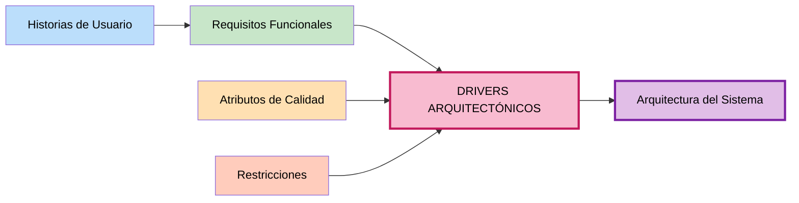

# Drivers Arquitectónicos — SIJASS

### DA10 — Regla de dosificación normativa y configurable ⚖️

**Origen:** RC11 (D.S. N.° 031-2010-SA), RF09

**Enunciado:** El rango objetivo de cloro debe cumplir la normativa peruana y ser configurable.

**¿Por qué influye?**
- La norma puede cambiar y el sistema no debería reescribirse por ello
- La regla de cálculo es conocimiento del negocio, no detalle técnico
- Debe poder auditarse qué regla se aplicó en cada medición

**Decisiones arquitectónicas derivadas:**
- `ReglaDosificacion` como **entidad del dominio**, no como constante en el código
- Rango objetivo (por defecto 0.5–1.0 mg/L) parametrizable
- Fórmulas de dosis por carga y dosis diaria implementadas en la capa de dominio
- Trazabilidad: cada medición registra reservorio, usuario y versión del modelo

---

## Matriz de relaciones

---

## Resumen de Drivers Arquitectónicos

| ID | Driver | Origen predominante | Impacto | Prioridad |
|---|---|---|---|---|
| **DA01** | Operación sin conexión | Restricción + Calidad | **Muy alto** | **Crítica** |
| **DA02** | Inferencia en el borde | Restricción | **Muy alto** | **Crítica** |
| **DA04** | Exactitud de la IA | Calidad | **Alto** | **Crítica** |
| **DA05** | Equipo de una persona | Restricción | **Alto** | **Crítica** |
| **DA03** | Rendimiento en gama media | Calidad + Restricción | **Alto** | **Alta** |
| **DA06** | Seguridad | Calidad | **Alto** | **Alta** |
| **DA07** | Modificabilidad | Calidad | **Alto** | **Alta** |
| **DA08** | Distribución sin tienda | Restricción | **Medio-Alto** | **Alta** |
| **DA09** | Consistencia de datos | Restricción + Funcional | **Medio-Alto** | **Alta** |
| **DA10** | Regla normativa configurable | Restricción + Funcional | **Medio** | **Media** |

---

## Ejemplo de decisión arquitectónica derivada

**Requisito funcional:** RF07 — El sistema debe estimar el cloro residual con IA.

**Atributo de calidad:** RNF01 — Sin señal, el operador registra mediciones; el 100 % se conserva localmente.

**Restricción:** RC01 — No hay conectividad en el reservorio.

**Driver arquitectónico resultante:** DA02 — La estimación debe ejecutarse en el teléfono, no en el servidor.

**Decisiones arquitectónicas:**
- Separar el **servicio de IA** del monolito (otra tecnología, otro ciclo de vida)
- Entrenar fuera de línea y **exportar a ONNX** con cuantización INT8
- **Distribuir el modelo** a la PWA y cachearlo con el Service Worker
- Ejecutar la inferencia con **ONNX Runtime Web** en el navegador
- El servidor **verifica después**, de forma asíncrona, cuando los datos se sincronizan

> Este encadenamiento — de un requisito y una restricción concreta hacia una decisión justificada — es exactamente lo que distingue a SIJASS de un caso ideal.

---

## Próximos pasos

Los drivers arquitectónicos servirán como guía para:
1. **Ejercicio 09:** Diseñar la arquitectura en capas
2. **Ejercicio 10:** Construir el diagrama final de arquitectura
