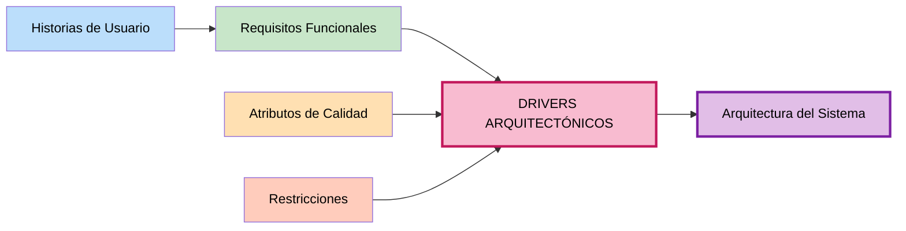

# Drivers Arquitectónicos — SIJASS

## Objetivo
Integrar los elementos identificados anteriormente (requisitos funcionales, atributos de calidad y restricciones) y determinar cuáles tienen una **influencia significativa** en las decisiones de arquitectura.

## Definición

**Drivers Arquitectónicos:** Son los requisitos funcionales, atributos de calidad y restricciones que influyen de manera importante en cómo se diseñará la arquitectura del sistema.

---

## Pregunta clave

> **¿Qué requisito o condición puede cambiar la forma en que diseñamos la arquitectura?**

---

## Método para identificar Drivers Arquitectónicos

### Para Requisitos Funcionales
- ¿Esta funcionalidad requiere una decisión importante de arquitectura?
- ¿Cambia la forma en que estructuramos el sistema?

### Para Atributos de Calidad
- ¿Este atributo afecta la estructura o el funcionamiento del sistema?
- ¿Obliga a introducir componentes o mecanismos nuevos?

### Para Restricciones
- ¿Esta condición limita o determina una decisión arquitectónica?

---

## Tabla de Drivers Arquitectónicos

| ID | Driver arquitectónico | Origen | ¿Por qué influye en la arquitectura? |
|---|---|---|---|
| **DA01** | El sistema debe operar por completo sin conexión y sincronizar después sin duplicar datos. | RNF01, RNF04, RC01, RF10 | Determina el tipo de cliente (PWA), el almacenamiento local y todo el mecanismo de sincronización. |
| **DA02** | La estimación del cloro debe ejecutarse en el teléfono del operador, no en el servidor. | RC01, RC08, RF07 | Obliga a separar el servicio de IA, exportar el modelo a ONNX y distribuirlo al cliente. |
| **DA03** | El modelo de IA debe correr en teléfonos de gama media en menos de 2 segundos. | RNF02, RNF08, RC02 | Condiciona la arquitectura del modelo, su tamaño y su cuantización. |
| **DA04** | La exactitud de la IA debe alcanzar ≥ 85 % con datos de campo variables. | RNF03 | Introduce la tarjeta de calibración, el humano en el ciclo y el versionado del modelo. |
| **DA05** | El sistema debe ser desarrollado y operado por una sola persona en ocho semanas. | RC03 | Descarta microservicios y obliga a un monolito modular con despliegue simple. |
| **DA06** | El sistema debe proteger las cuentas y los datos de la junta. | RNF05 | Define autenticación, autorización por rol y cifrado de credenciales. |
| **DA07** | Deben poder agregarse módulos nuevos sin modificar los existentes. | RNF07 | Impone separación en capas, regla de dependencia hacia el dominio e interfaces de repositorio. |
| **DA08** | El sistema debe distribuirse sin tienda de aplicaciones y con costo de adopción mínimo. | RC04, RC05, RNF08 | Determina PWA, software libre y una sola base de código. |
| **DA09** | Los datos de asociados y pagos requieren consistencia fuerte. | RC07, RF04, RF05 | Determina base de datos relacional con transacciones ACID. |
| **DA10** | El rango objetivo de cloro debe cumplir la normativa peruana y ser configurable. | RC11, RF09 | Convierte la regla de dosificación en una entidad del dominio, parametrizable. |

---

## Detalle de los Drivers Arquitectónicos

### DA01 — Operación sin conexión con sincronización idempotente 📴

**Origen:** RNF01 (disponibilidad sin conexión), RNF04 (integridad), RC01 (conectividad nula), RF10

**Enunciado:** El sistema debe operar por completo sin conexión y sincronizar después sin duplicar datos.

**¿Por qué influye?**
- Determina si el cliente es "delgado" (depende del servidor) o "grueso" (autónomo)
- Define dónde vive el estado mientras no hay red
- Obliga a diseñar un protocolo de sincronización tolerante a fallos
- Condiciona el modelo de datos: operaciones de solo inserción

**Decisiones arquitectónicas derivadas:**
- Aplicación web progresiva (PWA) con Service Worker (Workbox)
- Persistencia local en IndexedDB mediante Dexie
- Cola local de operaciones con estado `pendiente` / `sincronizado`
- UUID generado **en el cliente**, no en el servidor (ADR-05)
- Claves de idempotencia almacenadas en Redis
- Endpoint de sincronización por lotes (`POST /sync`)

> Es el driver **dominante** de SIJASS: define la forma general de la solución.

---

### DA02 — Inferencia en el borde (*edge AI*) 🧠

**Origen:** RC01 (no hay señal), RC08 (ONNX Runtime Web), RF07

**Enunciado:** La estimación del cloro debe ejecutarse en el teléfono del operador, no en el servidor.

**¿Por qué influye?**
- Separa el ciclo de vida del modelo del ciclo de vida del backend
- Obliga a distribuir el modelo como un artefacto descargable
- Cambia el rol del servidor: pasa de *ejecutar* a *verificar*
- Introduce una tecnología distinta (Python) al stack principal (Node.js)

**Decisiones arquitectónicas derivadas:**
- **Servicio de IA independiente** (Python, FastAPI, ONNX Runtime), separado del monolito
- Pipeline de entrenamiento fuera de línea que publica modelos versionados
- Exportación del modelo a formato `.onnx`
- Descarga y caché del modelo `.onnx` por el Service Worker
- Almacén de objetos para fotos y modelos
- Verificación asíncrona en el servidor cuando los datos se sincronizan

---

### DA03 — Rendimiento en hardware modesto ⚡

**Origen:** RNF02 (≤ 2 s), RNF08 (Android 8+), RC02 (gama media-baja)

**Enunciado:** El modelo de IA debe correr en teléfonos de gama media en menos de 2 segundos.

**¿Por qué influye?**
- Descarta arquitecturas de red pesadas
- Determina el formato y el tamaño del artefacto distribuido
- Obliga a probar en dispositivos reales, no solo en emulador

**Decisiones arquitectónicas derivadas:**
- **MobileNetV3-Small** preentrenada en ImageNet y ajustada con fotografías propias
- Cuantización **INT8** del modelo exportado
- YOLOv8-nano como alternativa solo si hiciera falta detectar el tubo antes de clasificar
- Pruebas tempranas en dispositivos representativos
- Caché en Redis para consultas repetidas en el backend

---

### DA04 — Exactitud de la IA bajo iluminación variable 🎯

**Origen:** RNF03 (≥ 85 %, MAE ≤ 0.2 mg/L)

**Enunciado:** La exactitud de la IA debe alcanzar ≥ 85 % con datos de campo variables.

**¿Por qué influye?**
- La luz de campo variable es la principal fuente de error del método actual
- Obliga a introducir mecanismos de corrección **antes** de la inferencia
- Requiere un camino de recuperación cuando el modelo no está seguro
- Exige trazabilidad para poder auditar un resultado dudoso

**Decisiones arquitectónicas derivadas:**
- **Tarjeta de calibración cromática** impresa junto al tubo en cada foto
- Corrección de balance de blancos y recorte (ROI) en el preprocesamiento
- Aumento de datos: iluminación, ángulo y ruido
- **Humano en el ciclo:** si la confianza < umbral, el operador confirma la lectura
- Las confirmaciones se convierten en muestras etiquetadas para reentrenar
- Cada medición guarda la **versión del modelo** que la produjo (entidad `ModeloIA`)
- Respaldo: clasificador por histograma HSV calibrado con la escala DPD

---

### DA05 — Equipo de una sola persona 👤

**Origen:** RC03 (un desarrollador, ocho semanas)

**Enunciado:** El sistema debe ser desarrollado y operado por una sola persona en ocho semanas.

**¿Por qué influye?**
- Descarta arquitecturas con alto costo operativo
- Obliga a minimizar el número de componentes desplegables
- Exige cerrar el alcance de forma estricta
- Determina que lo más riesgoso se aborde primero

**Decisiones arquitectónicas derivadas:**
- **Monolito modular** en lugar de microservicios (ADR-01)
- Los módulos ofrecen la separación de responsabilidades de los microservicios sin su costo operativo
- Los módulos pueden separarse más adelante si el sistema crece
- Solo el servicio de IA se separa, y por una razón concreta: usa otra tecnología y otro ciclo de vida
- Alcance del MVP cerrado en una tabla explícita; lo nuevo pasa a trabajo futuro

---

### DA06 — Seguridad de cuentas y datos 🔒

**Origen:** RNF05 (HTTPS, JWT, bcrypt)

**Enunciado:** El sistema debe proteger las cuentas y los datos de la junta.

**¿Por qué influye?**
- Determina el mecanismo de autenticación y autorización
- Define dónde se valida el acceso en el flujo de una petición
- Afecta cómo se almacenan las credenciales

**Decisiones arquitectónicas derivadas:**
- Módulo de **identidad y acceso** como módulo de dominio propio
- Tokens **JWT** con expiración; sesiones cacheadas en Redis
- Contraseñas cifradas con **bcrypt** en la capa de infraestructura
- Control de acceso basado en roles (RBAC): operador, tesorero, consejo
- Comunicación **HTTPS** obligatoria
- Mínimo privilegio aplicado desde el diseño, no añadido al final

---

### DA07 — Modificabilidad por módulos 🔧

**Origen:** RNF07 (agregar módulos sin modificar los existentes)

**Enunciado:** Deben poder agregarse módulos nuevos sin modificar los existentes.

**¿Por qué influye?**
- Determina cómo se estructura internamente el backend
- Define la dirección de las dependencias entre capas
- Condiciona dónde viven las reglas de negocio

**Decisiones arquitectónicas derivadas:**
- **Cuatro capas:** presentación (API REST), aplicación (casos de uso), dominio (entidades y reglas), infraestructura (adaptadores)
- **Regla de dependencia:** Presentación → Aplicación → Dominio ← Infraestructura
- Las interfaces de repositorio se **definen en el dominio** y la infraestructura las implementa (inversión de dependencias)
- **Cuatro módulos de dominio:** identidad y acceso, asociados y cuotas, cloración, sincronización
- Alta cohesión dentro de cada módulo, bajo acoplamiento entre ellos
- La fórmula de dosificación no depende de la base de datos ni del framework

---

### DA08 — Distribución sin tienda y costo mínimo 🌐

**Origen:** RC04 (PWA), RC05 (software libre), RNF08 (portabilidad)

**Enunciado:** El sistema debe distribuirse sin tienda de aplicaciones y con costo de adopción mínimo.

**¿Por qué influye?**
- Determina el tipo de cliente y su tecnología
- Condiciona qué APIs están disponibles
- Afecta el modelo de actualización del software

**Decisiones arquitectónicas derivadas:**
- **PWA** en lugar de aplicación nativa Android (ADR-02)
- Una sola base de código para todos los dispositivos
- Instalación desde el navegador, actualización inmediata
- React + Vite + Workbox en el cliente
- Stack completo de software libre (PostgreSQL, Redis, ONNX Runtime)
- Basta un teléfono con navegador para adoptar el sistema

---

### DA09 — Consistencia fuerte en datos económicos 🗄️

**Origen:** RC07 (PostgreSQL), RF04 (pagos), RF05 (morosidad)

**Enunciado:** Los datos de asociados y pagos requieren consistencia fuerte.

**¿Por qué influye?**
- Determina el tipo de motor de base de datos
- Define si se usan transacciones y de qué tipo
- Condiciona el modelo de datos

**Decisiones arquitectónicas derivadas:**
- **PostgreSQL** en lugar de una base NoSQL (ADR-04)
- Modelo relacional normalizado con claves foráneas
- Transacciones ACID para las operaciones de pago
- Repositorios implementados en la capa de infraestructura
- Redis se usa solo para caché e idempotencia, nunca como fuente de verdad

---

### DA10 — Regla de dosificación normativa y configurable ⚖️

**Origen:** RC11 (D.S. N.° 031-2010-SA), RF09

**Enunciado:** El rango objetivo de cloro debe cumplir la normativa peruana y ser configurable.

**¿Por qué influye?**
- La norma puede cambiar y el sistema no debería reescribirse por ello
- La regla de cálculo es conocimiento del negocio, no detalle técnico
- Debe poder auditarse qué regla se aplicó en cada medición

**Decisiones arquitectónicas derivadas:**
- `ReglaDosificacion` como **entidad del dominio**, no como constante en el código
- Rango objetivo (por defecto 0.5–1.0 mg/L) parametrizable
- Fórmulas de dosis por carga y dosis diaria implementadas en la capa de dominio
- Trazabilidad: cada medición registra reservorio, usuario y versión del modelo

---

## Matriz de relaciones

---

## Resumen de Drivers Arquitectónicos

| ID | Driver | Origen predominante | Impacto | Prioridad |
|---|---|---|---|---|
| **DA01** | Operación sin conexión | Restricción + Calidad | **Muy alto** | **Crítica** |
| **DA02** | Inferencia en el borde | Restricción | **Muy alto** | **Crítica** |
| **DA04** | Exactitud de la IA | Calidad | **Alto** | **Crítica** |
| **DA05** | Equipo de una persona | Restricción | **Alto** | **Crítica** |
| **DA03** | Rendimiento en gama media | Calidad + Restricción | **Alto** | **Alta** |
| **DA06** | Seguridad | Calidad | **Alto** | **Alta** |
| **DA07** | Modificabilidad | Calidad | **Alto** | **Alta** |
| **DA08** | Distribución sin tienda | Restricción | **Medio-Alto** | **Alta** |
| **DA09** | Consistencia de datos | Restricción + Funcional | **Medio-Alto** | **Alta** |
| **DA10** | Regla normativa configurable | Restricción + Funcional | **Medio** | **Media** |

---

## Ejemplo de decisión arquitectónica derivada

**Requisito funcional:** RF07 — El sistema debe estimar el cloro residual con IA.

**Atributo de calidad:** RNF01 — Sin señal, el operador registra mediciones; el 100 % se conserva localmente.

**Restricción:** RC01 — No hay conectividad en el reservorio.

**Driver arquitectónico resultante:** DA02 — La estimación debe ejecutarse en el teléfono, no en el servidor.

**Decisiones arquitectónicas:**
- Separar el **servicio de IA** del monolito (otra tecnología, otro ciclo de vida)
- Entrenar fuera de línea y **exportar a ONNX** con cuantización INT8
- **Distribuir el modelo** a la PWA y cachearlo con el Service Worker
- Ejecutar la inferencia con **ONNX Runtime Web** en el navegador
- El servidor **verifica después**, de forma asíncrona, cuando los datos se sincronizan

> Este encadenamiento — de un requisito y una restricción concreta hacia una decisión justificada — es exactamente lo que distingue a SIJASS de un caso ideal.

---

## Próximos pasos

Los drivers arquitectónicos servirán como guía para:
1. **Ejercicio 09:** Diseñar la arquitectura en capas
2. **Ejercicio 10:** Construir el diagrama final de arquitectura
