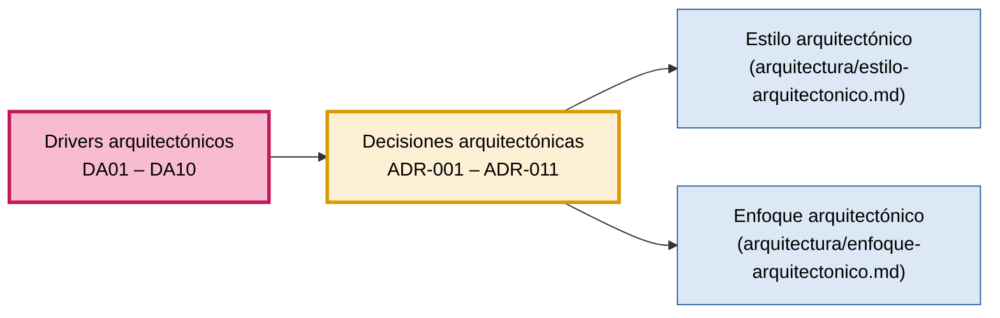

# Decisiones Arquitectónicas — SIJASS

**ADR (Architecture Decision Record)** significa Registro de Decisión Arquitectónica y documenta las decisiones importantes que tomamos durante el diseño de la arquitectura del software, junto con su justificación.

Cada decisión responde a uno o más **drivers arquitectónicos** (DA01–DA10, ver `06-drivers-arquitectonicos.md`), que a su vez provienen de los atributos de calidad y las restricciones del entorno real de las JASS de Ayacucho.

---

## Tabla de decisiones

| ID | Decisión arquitectónica | Driver relacionado | Justificación | Resultado |
| --- | --- | --- | --- | --- |
| **ADR-001** | Monolito modular (NestJS) | DA05 - Equipo de una persona; DA07 - Modificabilidad | Ofrece la separación de responsabilidades de los microservicios sin su costo operativo: un solo desarrollador no puede operar varios servicios en ocho semanas. | Un solo despliegue con los módulos Identidad y acceso, Asociados y cuotas, Cloración y Sincronización. |
| **ADR-002** | Aplicación web progresiva (PWA) | DA08 - Distribución sin tienda; DA01 - Operación sin conexión | Una sola base de código, instalación directa desde el navegador y acceso a Service Worker e IndexedDB para trabajar sin red. | Cliente en React + Vite + Workbox, con persistencia local en Dexie (IndexedDB). |
| **ADR-003** | Inferencia en el dispositivo (ONNX Runtime Web) | DA02 - Inferencia en el borde; DA03 - Rendimiento en gama media | En el reservorio no hay señal: la estimación del cloro no puede depender de una llamada al servidor. | Modelo MobileNetV3-Small cuantizado a INT8 (`.onnx`), cacheado por el Service Worker; el servidor solo verifica después. |
| **ADR-004** | PostgreSQL como base de datos transaccional | DA09 - Consistencia de datos | Los datos son relacionales (asociados, pagos, mediciones) y los pagos exigen consistencia fuerte e integridad referencial. | Modelo relacional normalizado con claves foráneas y transacciones ACID. |
| **ADR-005** | Cola local de operaciones con UUID generado en el cliente | DA01 - Operación sin conexión; DA09 - Consistencia de datos | La idempotencia basta para sincronizar sin duplicar y es más simple que otras estrategias de reconciliación. | Operaciones de solo inserción con `uuid_cliente`, enviadas por lote a `POST /sync`; reenviar un lote no duplica registros. |
| **ADR-006** | Clean Architecture en cuatro capas dentro de cada módulo | DA07 - Modificabilidad | Separar las reglas del negocio de los detalles tecnológicos: la fórmula de dosificación no debe depender de la base de datos ni del framework. | Presentación, Aplicación, Dominio e Infraestructura con la regla `Presentación → Aplicación → Dominio ← Infraestructura`. |
| **ADR-007** | Servicio de IA independiente (Python, FastAPI, ONNX Runtime) | DA02 - Inferencia en el borde; DA04 - Exactitud de la IA | Es la excepción justificada al monolito: usa otra tecnología (Python) y tiene otro ciclo de vida (entrenar y publicar modelos). | Servicio que verifica lecturas de forma asíncrona; entidad `ModeloIA` y `modelo_id` en cada medición; confirmación manual cuando la confianza es baja (humano en el ciclo). |
| **ADR-008** | Autenticación con JWT y control de acceso por roles (RBAC) | DA06 - Seguridad | Los datos de asociados y pagos son sensibles, y cada rol (operador, tesorero, consejo) solo debe acceder a sus funciones. | Módulo Identidad y acceso; contraseñas con bcrypt; tokens JWT con expiración; verificación de token y rol en la capa de presentación; todo el tráfico sobre HTTPS. |
| **ADR-009** | Redis para caché y claves de idempotencia; PostgreSQL como fuente de verdad | DA03 - Rendimiento en gama media; DA09 - Consistencia de datos | Reducir consultas repetidas y verificar rápido si una operación ya fue procesada, sin mover la fuente de verdad fuera de PostgreSQL. | Caché de consultas frecuentes y registro de UUID ya procesados en Redis. |
| **ADR-010** | Regla de dosificación como entidad de dominio parametrizable | DA10 - Regla normativa configurable | La norma (D.S. N.° 031-2010-SA) puede cambiar y la fórmula de cálculo es conocimiento del negocio, no un detalle técnico. | `ReglaDosificacion` en el dominio; rango objetivo configurable (0.5–1.0 mg/L por defecto); cada medición registra reservorio, usuario y versión del modelo. |
| **ADR-011** | Integración de mensajería mediante interfaz y adaptador | DA07 - Modificabilidad (RC10) | El envío de alertas se delega a un servicio externo y su caída no debe impedir registrar una medición. | Interfaz de notificación en el dominio y adaptador en infraestructura, invocado de forma asíncrona desde el módulo Cloración. |

---

## Alternativas descartadas

Las cinco primeras decisiones ya estaban registradas en `05-restricciones.md`; aquí se conservan con su alternativa y la restricción que las motiva.

| ADR | Alternativa descartada | Restricción que la motiva |
| --- | --- | --- |
| **ADR-001** | Microservicios | RC03 — un solo desarrollador, ocho semanas |
| **ADR-002** | Aplicación nativa Android | RC04, RC05 — una base de código, sin tienda |
| **ADR-003** | Inferencia solo en servidor | RC01 — no hay señal en el reservorio |
| **ADR-004** | Base de datos NoSQL | RC07 — datos relacionales que requieren consistencia |
| **ADR-005** | Sincronización con CRDT | RC01, RC03 — la idempotencia basta y es más simple |

---

## Trazabilidad: drivers → decisiones

Cada driver tiene al menos una decisión que lo responde.

| Driver | Decisiones que lo responden |
| --- | --- |
| **DA01** — Operación sin conexión | ADR-002, ADR-005 |
| **DA02** — Inferencia en el borde | ADR-003, ADR-007 |
| **DA03** — Rendimiento en gama media | ADR-003, ADR-009 |
| **DA04** — Exactitud de la IA | ADR-007 |
| **DA05** — Equipo de una persona | ADR-001 |
| **DA06** — Seguridad | ADR-008 |
| **DA07** — Modificabilidad | ADR-001, ADR-006, ADR-011 |
| **DA08** — Distribución sin tienda | ADR-002 |
| **DA09** — Consistencia de datos | ADR-004, ADR-005, ADR-009 |
| **DA10** — Regla normativa configurable | ADR-010 |

---

## Próximos pasos

Las decisiones registradas se materializan en dos documentos de la carpeta `arquitectura/`:
1. **Estilo arquitectónico:** cómo se organiza el sistema completo (monolito modular, servicio de IA y cliente sin conexión).
2. **Enfoque arquitectónico:** cómo se organiza cada módulo por dentro (Clean Architecture).
