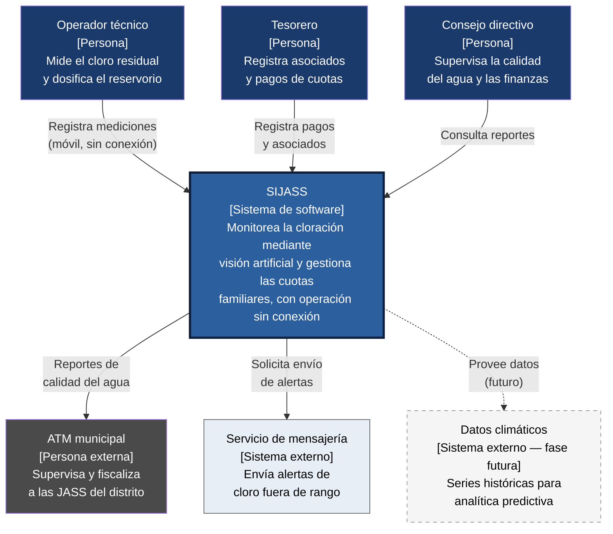
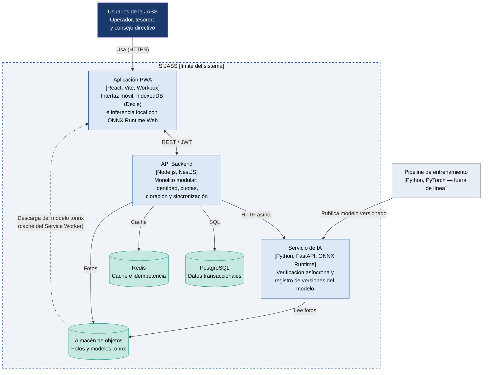
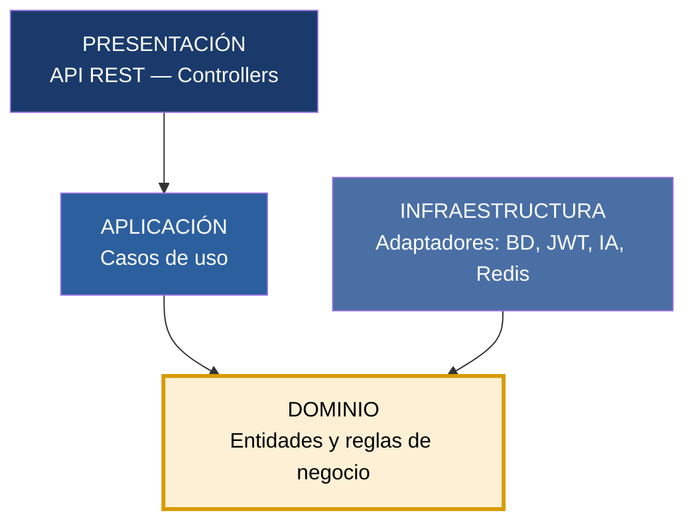
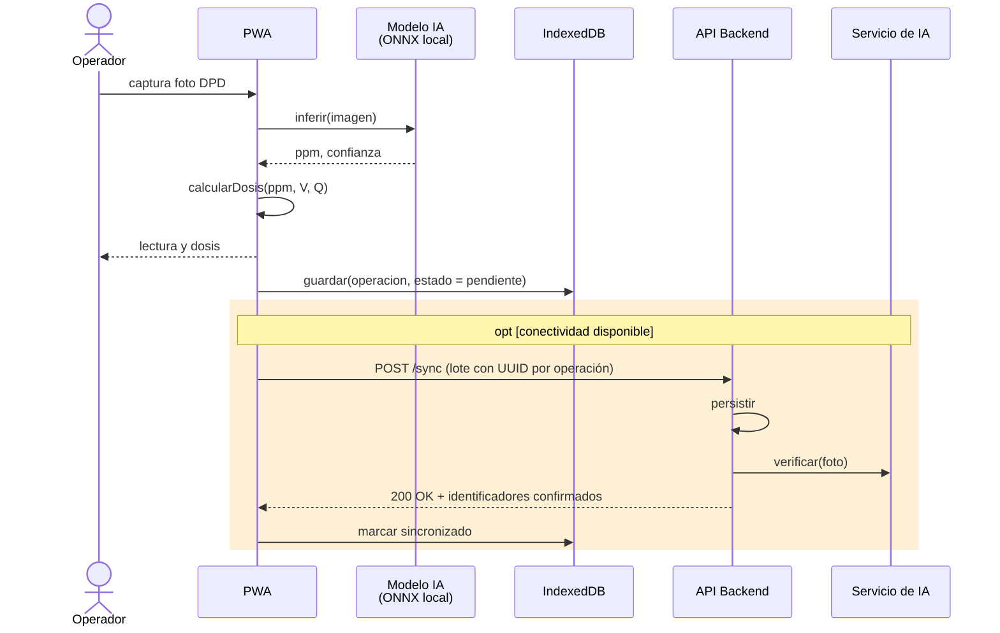
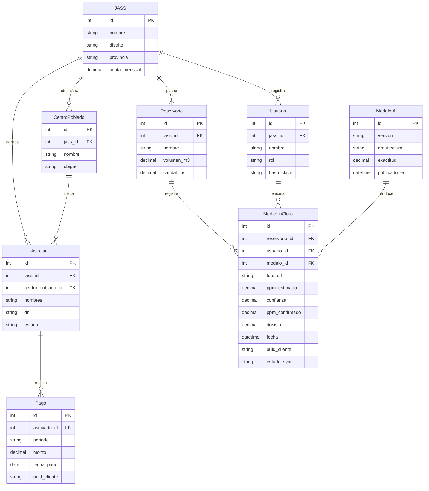

# Arquitectura Inicial del Sistema — SIJASS

**Sistema de Monitoreo Inteligente para Juntas Administradoras de Servicios de Saneamiento (JASS) en Ayacucho**

---

## Objetivo
Organizar los módulos identificados anteriormente dentro de una primera propuesta de arquitectura, respondiendo a los drivers arquitectónicos definidos en el Ejercicio 08.

## Definición

**Diseño de Arquitectura:** Es el proceso de organizar las principales partes del sistema y definir cómo se relacionan entre sí para cumplir con sus requisitos y responder a los atributos de calidad y restricciones.

---

## Estilo arquitectónico

Se adopta un **monolito modular** en el backend, complementado con un **servicio de IA independiente** y una **aplicación cliente con capacidad sin conexión**.

| Decisión | Justificación |
|---|---|
| **Monolito modular** | Ofrece la separación de responsabilidades de los microservicios sin su costo operativo — adecuado para un equipo de una sola persona (DA05). |
| **Servicio de IA separado** | Usa otra tecnología (Python) y tiene otro ciclo de vida que el backend (DA02). |
| **Cliente con capacidad sin conexión** | El operador trabaja en reservorios sin señal (DA01). |

### Principios de arquitectura aplicados

| Principio | Aplicación en SIJASS |
|---|---|
| Separación de responsabilidades | Capas de presentación, aplicación, dominio e infraestructura |
| Alta cohesión y bajo acoplamiento | Módulos por dominio (cuotas, cloración, sincronización) que se comunican por interfaces |
| Inversión de dependencias | El dominio define los repositorios; la infraestructura los implementa |
| Diseño para fallos de red | Persistencia local e identificadores únicos generados en el cliente |
| Escalabilidad horizontal | Backend sin estado; sesiones con JWT y caché en Redis |
| Seguridad por diseño | Roles, HTTPS y mínimo privilegio desde el inicio |

---

## Vista de contexto (C4 — nivel 1)

---

## Vista de contenedores (C4 — nivel 2)

La PWA descarga y guarda en caché el modelo `.onnx`, de modo que la inferencia no depende del servidor; el Servicio de IA solo verifica las lecturas de forma asíncrona cuando los datos se sincronizan.

---

## Vista lógica: capas y módulos del backend

El backend se organiza en **cuatro capas** atravesadas por **cuatro módulos de dominio**. Las dependencias apuntan siempre hacia el dominio, de manera que las reglas de negocio —como la fórmula de dosificación— no dependen de la base de datos ni del framework.

| Capa ↓ / Módulo → | Identidad y acceso | Asociados y cuotas | Cloración | Sincronización |
|---|---|---|---|---|
| **Presentación** (API REST) | `AuthController` | `AsociadoController` `PagoController` | `MedicionController` | `SyncController` |
| **Aplicación** (casos de uso) | `IniciarSesion` `AsignarRol` | `RegistrarPago` `ConsultarMorosidad` | `RegistrarMedicion` `CalcularDosis` | `ProcesarLote` `ResolverConflicto` |
| **Dominio** (entidades y reglas) | `Usuario`, `Rol` | `Asociado`, `Cuota`, `Pago` | `Medicion`, `Reservorio`, `ReglaDosificacion` | `Operacion`, `Lote` |
| **Infraestructura** (adaptadores) | JWT, bcrypt | Repositorio PostgreSQL | Repositorio, cliente IA, almacén de objetos | Redis (claves de idempotencia) |

**Regla de dependencia:**
`Presentación → Aplicación → Dominio ← Infraestructura`

*(las interfaces de repositorio se definen en el dominio y la infraestructura las implementa)*

---

## Descripción de las capas

| Capa | Pregunta que responde | Responsabilidades |
|---|---|---|
| **Presentación** | ¿Cómo interactúa el usuario? | Exponer la API REST, validar entrada, verificar tokens JWT y traducir peticiones HTTP a llamadas de casos de uso. |
| **Aplicación** | ¿Qué hace el sistema? | Orquestar los casos de uso (registrar medición, procesar lote, consultar morosidad) coordinando entidades del dominio. |
| **Dominio** | ¿Cuáles son las reglas? | Contener las entidades y las reglas de negocio: fórmula de dosificación, rango objetivo de cloro, estados de un pago. No depende de nada externo. |
| **Infraestructura** | ¿Cómo se conecta al mundo? | Implementar los repositorios definidos en el dominio y los adaptadores a PostgreSQL, Redis, el almacén de objetos, JWT/bcrypt y el servicio de IA. |

---

## Módulos de dominio

### Módulo Identidad y acceso
- Autenticación de usuarios (RF01)
- Control de acceso basado en roles: operador, tesorero, consejo
- Tokens JWT con expiración, contraseñas con bcrypt

### Módulo Asociados y cuotas
- Registro y actualización de asociados (RF03)
- Registro de pagos de cuotas por periodo (RF04)
- Consulta del estado de morosidad (RF05)

### Módulo Cloración
- Registro de mediciones de cloro (RF06, RF07)
- Confirmación manual de lecturas de baja confianza (RF08)
- Cálculo de la dosis de hipoclorito (RF09)
- Reporte histórico de calidad del agua (RF11)
- Alertas de cloro fuera de rango (RF12)
- **Integración:** servicio de IA, almacén de objetos, servicio de mensajería

### Módulo Sincronización
- Procesamiento de lotes de operaciones pendientes (RF10)
- Verificación de idempotencia mediante claves en Redis
- Resolución de conflictos y confirmación de identificadores

---

## Flujo principal: registrar una medición de cloro (CU01)

Toda la primera parte ocurre en el teléfono **sin conexión**; el fragmento `opt` se ejecuta solo cuando hay señal.

---

## Modelo conceptual de datos

**Notas del modelo:**
- Una JASS puede administrar **varios centros poblados**
- Cada medición registra el **reservorio**, el **usuario** y la **versión del modelo de IA** que la produjo — esto da trazabilidad (DA04)
- `uuid_cliente` en `Pago` y `MedicionCloro` es el identificador generado en el teléfono que garantiza la idempotencia (DA01)

---

## Justificación de la arquitectura

### Relación con los Drivers Arquitectónicos

| Driver | ¿Cómo se refleja en esta arquitectura? |
|---|---|
| **DA01 — Operación sin conexión** | PWA con Service Worker, IndexedDB y cola local; módulo de Sincronización con idempotencia en Redis y UUID de cliente. |
| **DA02 — Inferencia en el borde** | Servicio de IA separado del monolito; modelo `.onnx` distribuido y cacheado en la PWA; verificación asíncrona en el servidor. |
| **DA03 — Rendimiento en gama media** | MobileNetV3-Small cuantizado a INT8; inferencia local sin latencia de red; caché en Redis. |
| **DA04 — Exactitud de la IA** | Entidad `ModeloIA` y campo `modelo_id` en cada medición; `ppm_confirmado` para el humano en el ciclo; pipeline de reentrenamiento. |
| **DA05 — Equipo de una persona** | Monolito modular en lugar de microservicios; un solo servicio separado, y con razón técnica. |
| **DA06 — Seguridad** | Módulo de Identidad y acceso; JWT y bcrypt en la capa de infraestructura; RBAC en la de presentación. |
| **DA07 — Modificabilidad** | Cuatro capas con regla de dependencia hacia el dominio; interfaces de repositorio definidas en el dominio. |
| **DA08 — Distribución sin tienda** | PWA sobre navegador Chromium; stack íntegramente de software libre. |
| **DA09 — Consistencia de datos** | PostgreSQL con modelo relacional normalizado y transacciones ACID; Redis solo como caché. |
| **DA10 — Regla normativa configurable** | `ReglaDosificacion` como entidad del dominio; rango objetivo parametrizable. |

### ¿Por qué monolito modular y no microservicios?

1. **Costo operativo:** un solo desarrollador no puede operar, desplegar y monitorear varios servicios en ocho semanas (DA05).
2. **Separación conservada:** los módulos de dominio ofrecen la misma separación de responsabilidades, con interfaces explícitas entre ellos.
3. **Evolución posible:** si el sistema crece, cada módulo puede extraerse como servicio sin rediseñar el dominio.
4. **Excepción justificada:** el servicio de IA sí se separa, porque usa otra tecnología (Python) y tiene otro ciclo de vida (entrenamiento y publicación de modelos).

---

## Próximos pasos

**Ejercicio 10:** Construir el diagrama final de arquitectura en draw.io, integrando actores, capas, contenedores y sistemas externos en un solo diagrama completo.

El siguiente entregable del curso desarrollará los niveles de **componentes** y **despliegue**, junto con los contratos de la API.

---

## Referencias

- Bass, L., Clements, P., & Kazman, R. (2021). *Software Architecture in Practice* (4th ed.). Addison-Wesley.
- Brown, S. (2018). *The C4 model for visualising software architecture*. https://c4model.com
- Martin, R. C. (2017). *Clean Architecture: A Craftsman's Guide to Software Structure and Design*. Prentice Hall.
- Nygard, M. (2011). *Documenting architecture decisions*. https://cognitect.com/blog/2011/11/15/documenting-architecture-decisions
