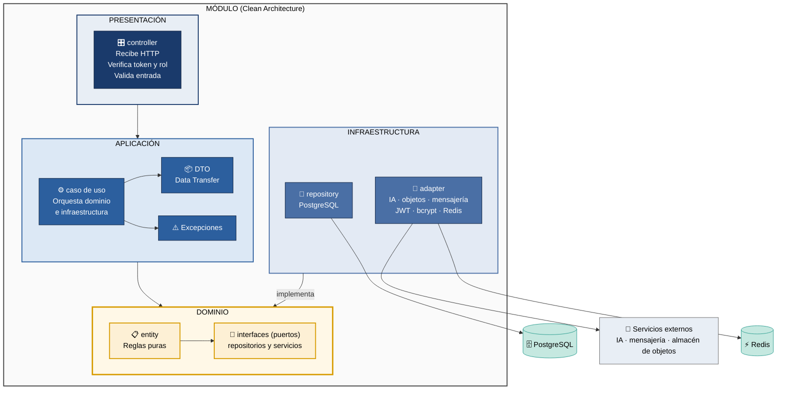

# Clean Architecture — Diagrama y Tabla (SIJASS)

Describe el **enfoque arquitectónico** de SIJASS: cómo se organiza cada módulo del backend por dentro. El estilo que organiza el sistema completo está en `estilo-arquitectonico.md`.

| Pregunta | Respuesta |
| --- | --- |
| **¿Qué enfoque se adopta?** | Clean Architecture en cuatro capas dentro de cada módulo del monolito (ADR-006). |
| **¿Qué driver responde?** | DA07 — Modificabilidad (RNF07): agregar un módulo, como el reporte de fugas, sin modificar los existentes. |
| **¿Qué protege?** | Las reglas de negocio, como la fórmula de dosificación y el rango normativo de cloro, no dependen de la base de datos ni del framework. |

---

## Diagrama: Las 4 Capas

Las flechas indican **dependencias de código**. Las dependencias apuntan siempre hacia el dominio: la infraestructura implementa las interfaces que el dominio define.

**Regla de dependencia:** `Presentación → Aplicación → Dominio ← Infraestructura`

---

---

