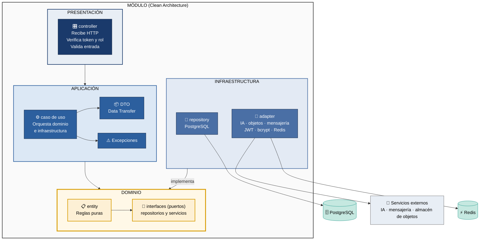

# Clean Architecture — Diagrama y Tabla (SIJASS)

Describe el **enfoque arquitectónico** de SIJASS: cómo se organiza cada módulo del backend por dentro. El estilo que organiza el sistema completo está en `estilo-arquitectonico.md`.

| Pregunta | Respuesta |
| --- | --- |
| **¿Qué enfoque se adopta?** | Clean Architecture en cuatro capas dentro de cada módulo del monolito (ADR-006). |
| **¿Qué driver responde?** | DA07 — Modificabilidad (RNF07): agregar un módulo, como el reporte de fugas, sin modificar los existentes. |
| **¿Qué protege?** | Las reglas de negocio, como la fórmula de dosificación y el rango normativo de cloro, no dependen de la base de datos ni del framework. |

---

## Diagrama: Las 4 Capas

Las flechas indican **dependencias de código**. Las dependencias apuntan siempre hacia el dominio: la infraestructura implementa las interfaces que el dominio define.

**Regla de dependencia:** `Presentación → Aplicación → Dominio ← Infraestructura`

---

## Tabla: Capas y Responsabilidades

Los nombres de archivo siguen la convención de NestJS con TypeScript (RC06). Son una convención propuesta para el equipo.

| Capa | Archivos | Responsabilidad | No Contiene |
| --- | --- | --- | --- |
| **PRESENTACIÓN** | `*.controller.ts`, guards de JWT y rol | Recibir HTTP, verificar token y rol, validar entrada, responder JSON | Lógica de negocio |
| **APLICACIÓN** | `*.use-case.ts`, `dtos/`, `exceptions/` | Orquestar dominio e infraestructura en cada caso de uso | Detalles técnicos (NestJS, SQL) |
| **DOMINIO** | `*.entity.ts`, `*.repository.ts` (solo interfaz), reglas como `ReglaDosificacion` | Reglas de negocio puras e interfaces de los puertos | NestJS, SQL, HTTP, Redis |
| **INFRAESTRUCTURA** | `*.postgres-repository.ts`, `*.adapter.ts` | Persistencia, servicio de IA, almacén de objetos, mensajería, JWT, bcrypt, Redis | Lógica de negocio |

---

## Capas aplicadas a los 4 módulos de SIJASS

| Capa ↓ / Módulo → | Identidad y acceso | Asociados y cuotas | Cloración | Sincronización |
| --- | --- | --- | --- | --- |
| **Presentación** | `AuthController` | `AsociadoController` `PagoController` | `MedicionController` | `SyncController` |
| **Aplicación** | `IniciarSesion` `AsignarRol` | `RegistrarPago` `ConsultarMorosidad` | `RegistrarMedicion` `CalcularDosis` | `ProcesarLote` `ResolverConflicto` |
| **Dominio** | `Usuario`, `Rol` | `Asociado`, `Cuota`, `Pago` | `Medicion`, `Reservorio`, `ReglaDosificacion` | `Operacion`, `Lote` |
| **Infraestructura** | JWT, bcrypt | Repositorio PostgreSQL | Repositorio, cliente IA, almacén de objetos, mensajería | Redis (claves de idempotencia) |

---

## Puertos y adaptadores

La inversión de dependencias se concreta en los puntos donde el sistema toca el mundo exterior. El dominio define la interfaz (puerto); la infraestructura aporta la implementación (adaptador).

| Puerto (dominio) | Adaptador (infraestructura) | Motivo |
| --- | --- | --- |
| `MedicionRepository`, `PagoRepository`, `AsociadoRepository`, `UsuarioRepository` | Repositorios sobre PostgreSQL | La lógica de cuotas y cloración no conoce el motor de base de datos (RC07). |
| `VerificadorDeLecturas` | Cliente HTTP del Servicio de IA | El servicio de IA tiene otro lenguaje y otro ciclo de vida (ADR-007). |
| `AlmacenDeFotos` | Cliente del almacén de objetos | Las fotos y los modelos no viven en la base transaccional. |
| `NotificadorDeAlertas` | Adaptador del servicio de mensajería | Su caída no debe impedir registrar una medición (RC10, ADR-011). |
| `RegistroDeIdempotencia` | Adaptador de Redis | Verificar rápido si un UUID ya fue procesado (ADR-009). |
| `HasheadorDeClaves`, `EmisorDeTokens` | bcrypt y JWT | El módulo de identidad no depende de una librería concreta (ADR-008). |

---

## Alcance del enfoque

- **Backend:** Clean Architecture se aplica a los cuatro módulos del monolito.
- **Servicio de IA:** es un servicio independiente en Python con su propio ciclo de vida; no sigue esta estructura.
- **PWA:** la inferencia, el cálculo de la dosis y el registro de operaciones corren en el teléfono sin conexión (RF07, RF09, RF10), por lo que el cliente se organiza por funcionalidades y no por estas capas.

---

## Referencias

- Martin, R. C. (2017). *Clean Architecture: A Craftsman's Guide to Software Structure and Design*. Prentice Hall.
- Bass, L., Clements, P., & Kazman, R. (2021). *Software Architecture in Practice* (4th ed.). Addison-Wesley.
