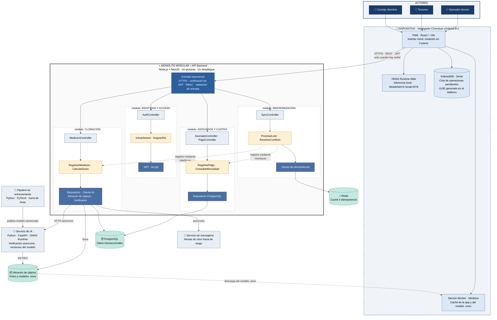
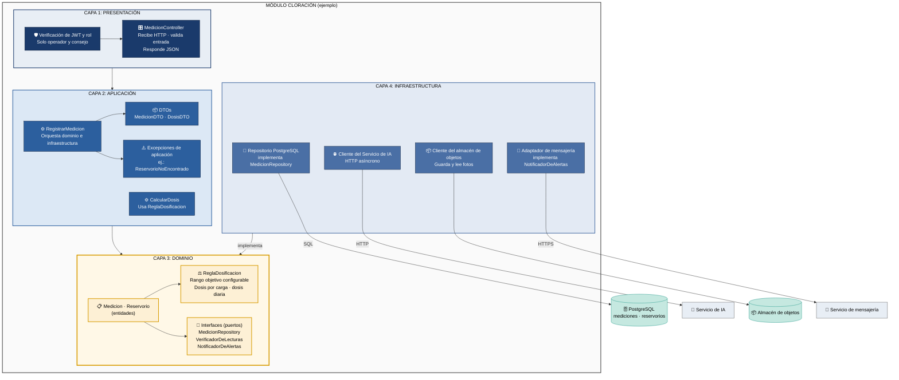
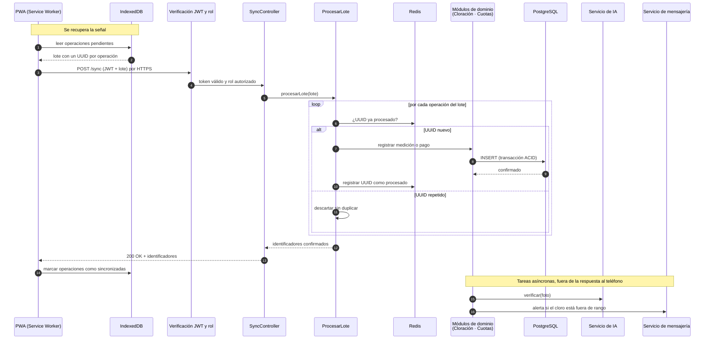
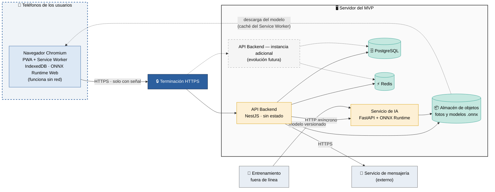

# Diagramas de Arquitectura — Monolito Modular, Servicio de IA y Cliente sin Conexión

Describe el **estilo arquitectónico** de SIJASS: cómo se organiza el sistema completo. Cómo se organiza cada módulo por dentro se explica en `enfoque-arquitectonico.md`.

---

## Estilos combinados

SIJASS no usa un único estilo: combina varios, cada uno elegido para responder a un driver concreto (ver `07-decisiones-arquitectonicas.md`).

| Estilo | Dónde se aplica | Driver | Decisión |
| --- | --- | --- | --- |
| **Cliente-servidor con API REST sin estado** | PWA ↔ API Backend, con JWT en cada petición | DA08, DA06 | ADR-002, ADR-008 |
| **Monolito modular** | Backend: Identidad y acceso, Asociados y cuotas, Cloración, Sincronización | DA05, DA07 | ADR-001 |
| **En capas** | Dentro de cada módulo del backend | DA07 | ADR-006 |
| **Sin conexión primero (*offline-first*) con inferencia en el borde** | PWA: Service Worker, IndexedDB y ONNX Runtime Web | DA01, DA02, DA03 | ADR-002, ADR-003 |
| **Servicio independiente** | Servicio de IA (Python), único componente separado del monolito | DA02, DA04 | ADR-007 |
| **Procesamiento por lotes idempotente** | Cola local en el teléfono y `POST /sync` en el servidor | DA01, DA09 | ADR-005 |

---

## DIAGRAMA 1: Arquitectura del sistema (Visión Global)

Muestra la **estructura global**: actores, la PWA con su capacidad sin conexión, el monolito con sus 4 módulos, el servicio de IA, los almacenes de datos y los sistemas externos.

**Cómo leerlo:**
- La **inferencia ocurre en el teléfono** (ONNX Runtime Web): el servidor no está en el camino crítico de una medición.
- El **servicio de IA** es el único componente fuera del monolito; solo verifica las fotos después de sincronizar.
- Los módulos del monolito se comunican **por interfaces**, no por dependencias directas (línea punteada).
- Los **datos climáticos** (analítica predictiva) quedan fuera del MVP y no aparecen en el diagrama.

---

## DIAGRAMA 2: Arquitectura en capas (Visión Interna)

Muestra cómo está **organizado cada módulo internamente** en capas. El ejemplo es el módulo **Cloración**, el más completo porque integra el servicio de IA, el almacén de objetos y la mensajería.

### Explicación de las capas

| Capa | Responsabilidad | No contiene | Ejemplo en Cloración |
| --- | --- | --- | --- |
| **PRESENTACIÓN** | Recibir HTTP, verificar token y rol, validar entrada, responder JSON | Lógica de negocio | `MedicionController` |
| **APLICACIÓN** | Orquestar los casos de uso coordinando dominio e infraestructura | Detalles técnicos | `RegistrarMedicion`, `CalcularDosis` |
| **DOMINIO** | Reglas de negocio puras e interfaces de los puertos | NestJS, SQL, HTTP | `ReglaDosificacion`, `Medicion` |
| **INFRAESTRUCTURA** | Detalles técnicos: PostgreSQL, servicio de IA, almacén de objetos, mensajería | Lógica de negocio | Repositorio PostgreSQL |

---

## DIAGRAMA 3: Flujo de ejecución (Caso de Uso: Sincronizar datos pendientes)

Muestra cómo interactúan las capas y los módulos cuando el teléfono recupera señal (CU04, RF10). Es el flujo que más ejercita el backend: idempotencia, persistencia transaccional y tareas asíncronas posteriores.

**Puntos clave:**
- Reenviar el mismo lote por un corte de red produce el mismo estado final (RNF04).
- La verificación de la IA y el envío de alertas **no bloquean** la respuesta: si la mensajería falla, la medición ya quedó registrada (RC10).

---

## DIAGRAMA 4: Vista de Despliegue (conceptual del MVP)

Muestra dónde vive cada componente. Es una **vista conceptual**: la tecnología concreta de alojamiento se definirá en el siguiente entregable (niveles de componentes y despliegue).

Se diseña para el MVP de un solo desarrollador (DA05): pocos componentes que operar. El backend no guarda estado de sesión (JWT), de modo que **agregar instancias es posible más adelante** sin rediseñar; por eso aparece punteada.

---

