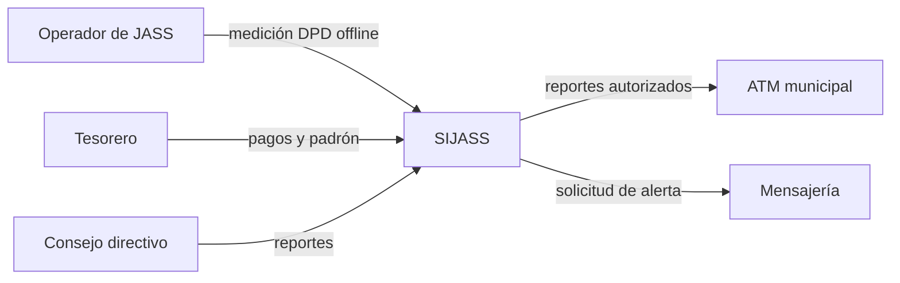

# C4 — Nivel 1: contexto

```mermaid
flowchart LR
 O[Operador de JASS] -->|medición DPD offline| S[SIJASS]
 T[Tesorero] -->|pagos y padrón| S
 C[Consejo directivo] -->|reportes| S
 S -->|reportes autorizados| A[ATM municipal]
 S -->|solicitud de alerta| M[Mensajería]
```
**Límite:** ATM es entidad externa; clima queda fuera del MVP.
