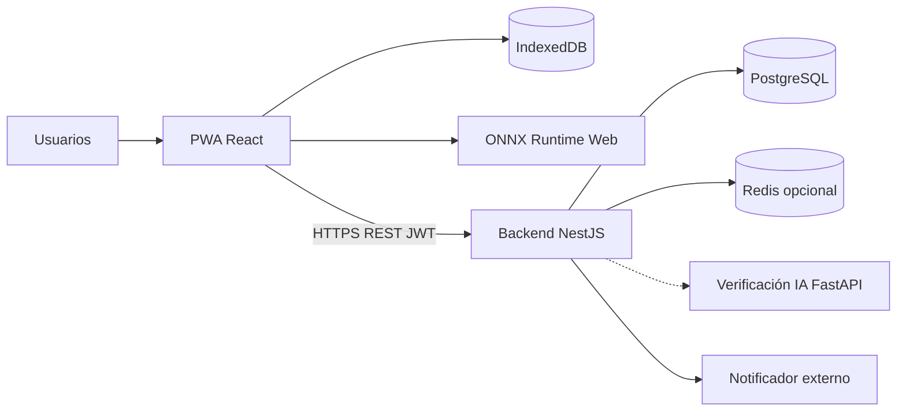

# C4 — Nivel 2: contenedores

```mermaid
flowchart LR
 U[Usuarios] --> P[PWA React]
 P --> L[(IndexedDB)]
 P --> O[ONNX Runtime Web]
 P -->|HTTPS REST JWT| B[Backend NestJS]
 B --> D[(PostgreSQL)]
 B --> R[(Redis opcional)]
 B -.-> I[Verificación IA FastAPI]
 B --> N[Notificador externo]
```
**Relaciones:** Inferencia local principal, verificación posterior opcional. Las credenciales nunca se guardan en código fuente.
