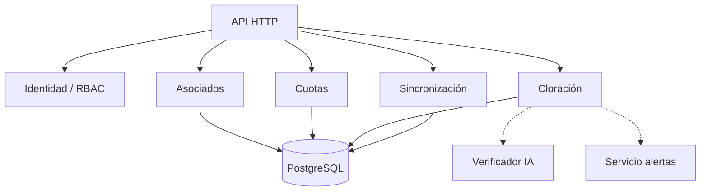

# C4 — Nivel 3: componentes del backend

```mermaid
flowchart TB
 API[API HTTP] --> AUTH[Identidad / RBAC]
 API --> ASO[Asociados]
 API --> CUO[Cuotas]
 API --> CLO[Cloración]
 API --> SYN[Sincronización]
 ASO --> DB[(PostgreSQL)]
 CUO --> DB
 CLO --> DB
 SYN --> DB
 CLO -.-> IA[Verificador IA]
 CLO -.-> MSG[Servicio alertas]
```
**Regla:** Los módulos no acceden directamente a tablas privadas de otros módulos; se coordinan por puertos de aplicación.
