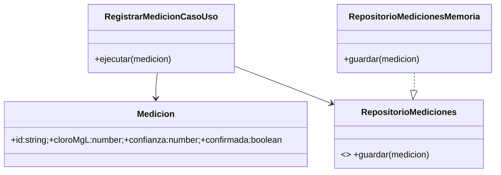
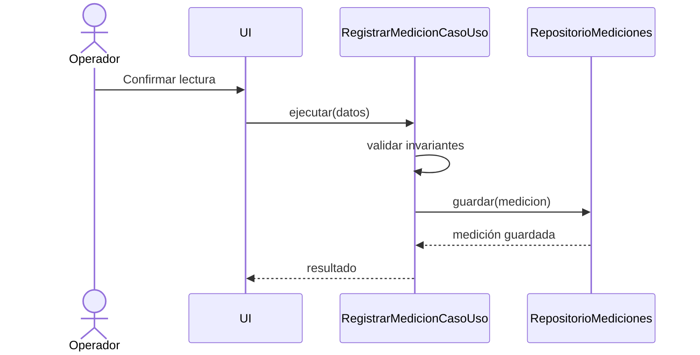

# C4 — Nivel 4: código del caso de uso de medición

```mermaid
classDiagram
 class RegistrarMedicionCasoUso {+ejecutar(medicion)}
 class Medicion {+id:string;+cloroMgL:number;+confianza:number;+confirmada:boolean}
 class RepositorioMediciones {<<interface>> +guardar(medicion)}
 class RepositorioMedicionesMemoria {+guardar(medicion)}
 RegistrarMedicionCasoUso --> Medicion
 RegistrarMedicionCasoUso --> RepositorioMediciones
 RepositorioMedicionesMemoria ..|> RepositorioMediciones
```

```mermaid
sequenceDiagram
 actor O as Operador
 participant U as UI
 participant C as RegistrarMedicionCasoUso
 participant R as RepositorioMediciones
 O->>U: Confirmar lectura
 U->>C: ejecutar(datos)
 C->>C: validar invariantes
 C->>R: guardar(medicion)
 R-->>C: medición guardada
 C-->>U: resultado
```
El código ejecutable se incluye en `tecnologia/siJASS-clean-architecture/src`.
